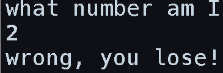
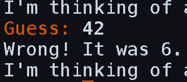

# Tiny games in haskell

## Rules

Inspired by the "write a game in 10 lines of basic" competition at
https://www.homeputerium.de (scroll to the bottom for their rules in english),
here are suggested categories and rules for tiny haskell games!

### gam-10-80-hs-base ("base")

- Write a playable game in haskell, in one file containing up to 10 lines of up to 80 characters each.
- This can be a stack, cabal, or runghc script. runghc scripts must note the ghc version tested with.
- Only the base package may be used.
- The game must be accompanied by a small screenshot.

### gam-10-80-hs-default ("default")

- As above, but a second file named Import.hs may be used, to gather imports and re-exports (only).
- All packages installed by default with the tested ghc version may be used.

### gam-10-80-hs-hackage ("hackage")

- As above, but all packages released on Hackage may be used.

<!--
General:
- In competition settings, the game must run on all major platforms for maximum points.
- A complete entry consists of a zipped, tarred, or git-tagged directory FOO containing FOO.hs and a README.
-->

## Games

### base

- [guess1 ](gam-10-80-hs-base/guess1.hs)

### default

- [guess2 ](gam-10-80-hs-default/guess2.hs)

### hackage
