# Haskell Tiny Game Jam

Inspired by the ongoing [BASIC 10Liner contest](https://www.homeputerium.de)
(see their english rules at the bottom of that page, and [their 2023 entries](https://gkanold.wixsite.com/homeputerium/games-list-2023))..

The first Haskell tiny games contest runs through February 2023!
Your mission: make a playable game in 10 lines of 80 characters of Haskell.
The prize.. glory! 
Also fun, learning, and advancing Haskell's suitability for game dev and programming in the small.

<div align=center>

[Rules](#rules)
| [Games](#games)
| [Let's play!](#lets-play)
| [Development](#development)

</div>

[Matrix]: https://matrix.to/#/#haskell-game:matrix.org
[IRC]:    https://web.libera.chat/#haskell-game

## Rules

Submit your [entries](#games) between now and end of February!
sm and f-a will be your judges.
See the #haskell-game [Matrix] or [IRC] chat 
or this repo's [issue tracker](issues) for help/feedback/announcements.

Here are the contest rules for this round (HTG1):

1. You can submit any number of entries to the official repo, haskell-game/tiny-games-hs.
   Each should be a playable game or amusement in one haskell file
   of up to 10 lines of up to 80 characters each, in one of the following categories:
   - `prelude-10-80`, allowing no imports
   - `base-10-80`, allowing imports from the base package
   - `default-10-80`, allowing imports from GHC's default packages, 
     plus an optional file named `Import.hs` to gather and re-export imports (only)
   - `hackage-10-80`, allowing imports from all of Hackage, and an `Import.hs` file.

2. The entry can be a script ([runghc], [stack], [cabal], ...)
   or a small program requiring compilation, but not a multi-file project.
   Our ideal is a self-contained executable 10 line program that just works, like BASIC programs.
   Here are some templates to give ideas:
   [prelude/template1](prelude/template1.hs),
   [base/template1](base/template1.hs),
   [default/template1](default/template1.hs),
   [hackage/template1](hackage/template1.hs)

3. Unlimited comments are permitted after line 11.
   The game's `category/gamename (author)` info should appear here,
   plus any essential info like player controls, so that the game is usable
   to someone seeing just this file.

4. Achieving programs that "just work" is a core principle and part of the challenge.
   The script or program must either
   be reliably runnable via shebang line (these use up your line count, but improve runnability; `env -S` is allowed)
   or contain a reliable build/run command line with all needed options, in the comments
   (the `play` script will use this).
   Games which aren't straightforward to run and enjoy are incomplete.
   See also the [runnability](#runnability) tips below.

5. The game should be portable, running on all major platforms, ideally.

6. A square thumbnail (screenshot) must be provided for the repo README -
   either a static png (which will be hyperlinked)
   or an animated gif (which should not be, so as not to break Github's player overlay).

7. A README file is optional but makes browsing your game more pleasant for website visitors.
   Feel free to include animations, or discussion of the game/code/your experience.

8. An unminified version of the code, easier to read and learn from, is optional but welcome.

9. You can update your entries freely until the contest end, 2023-02-28 11:59:59 UTC,
   at which time they are frozen for posterity and judging (no exceptions).
   If you need to share post-contest improvements, you are welcome to publish as new files in the same directory.

[runghc]: https://downloads.haskell.org/ghc/latest/docs/users_guide/runghc.html
[stack]:  https://docs.haskellstack.org/en/stable/script_command
[cabal]:  https://cabal.readthedocs.io/en/3.6/cabal-commands.html#cabal-v2-run

## Games

Here are the entries received so far!

### prelude-10-80
<!-- (No imports) -->
<table>
<tr>
<td><a href="prelude/guess1">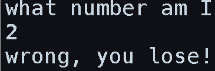<br>guess1</a><br>(sm)</td>
<td><a href="prelude/pure-doors">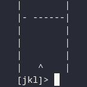<br>pure-doors</a><br>(tristanC)</td>
<td><a href="prelude/fifteen"><br>fifteen</a><br>(bradrn)</td>
<td>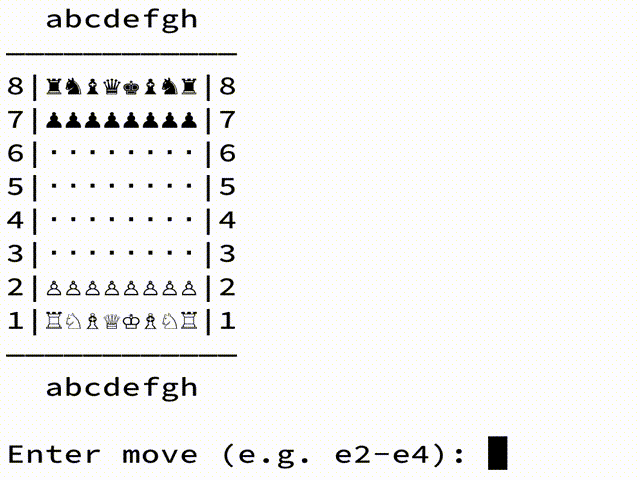<a href="prelude/chess"><br>chess</a><br>(fizruk)</td>
<td><a href="prelude/sudoku">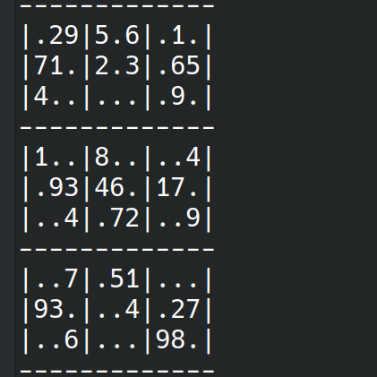<br>sudoku</a><br>(elderephemera)</td>
</tr>
<tr>
<td>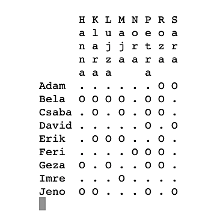<br><a href="prelude/matchmaking">matchmaking</a><br>(migmit)</td>
<td>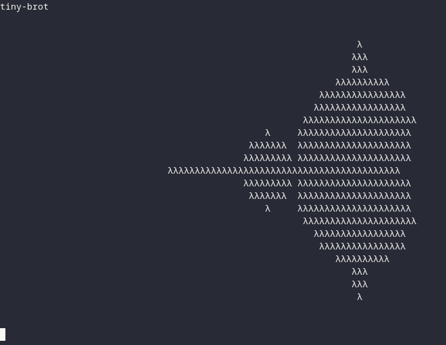<br><a href="prelude/tiny-brot">tiny-brot</a><br>(tristanC)</td>
<td>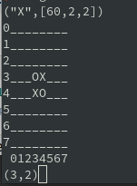<br><a href="prelude/mini-othello/mini-othello.hs">mini-othello</a><br>(hellwolf)</td>
<td><a href="prelude/one-dot">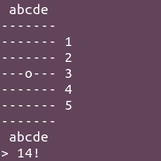<br>one-dot</a><br>(OsePedro)</td>
<td><a href="prelude/expressit">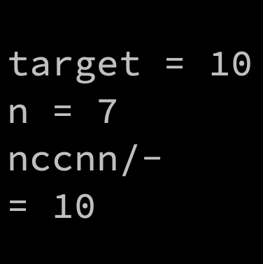<br>expressit</a><br>(Greg8128)</td>
</tr>
<tr>
<td><a href="prelude/life">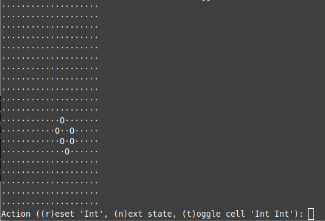<br>life</a><br>(Rens van Hienen)</td>
</tr>
</table>

### base-10-80
<!-- (Just the base package) -->
<table>
<tr>
<td><a href="base/timing"><br>timing</a><br>(TravisCardwell)</td>
<td><a href="base/shoot">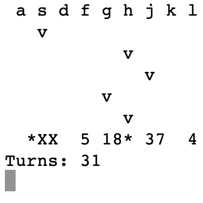<br>shoot</a><br>(migmit)</td>
<td><a href="base/log2048"><br>log2048</a><br>(Lysxia)</td>
<td>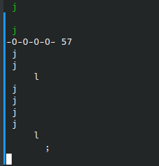<a href="base/rhythm"><br>rhythm</a><br>(elderephemera)</td>
<td><a href="base/peyton-says">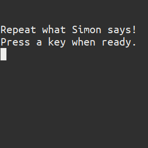<br>peyton-says</a><br>(gergoerdi)</td>
</tr>
<tr>
<td><a href="base/acey-deucey">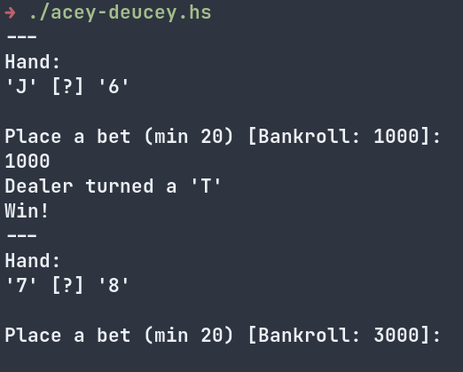<br>acey-deucey</a><br>(trevarj)</td>
<td><a href="base/flower-seeds">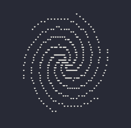<br>flower-seeds</a><br>(tristanC)</td>
<td><br><a href="base/lambda-ray">lambda-ray</a><br>(tristanC)</td>
</tr>
</table>

### default-10-80
<!-- (Just the packages that come with GHC) -->
<table>
<tr>
<td><a href="default/type-and-furious">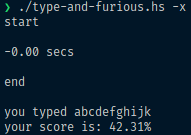<br>type-and-furious</a><br>(lsmor)</td>
<td><a href="default/shmupemup">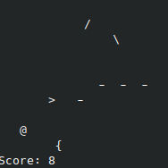<br>shmupemup</a><br>(elderephemera)</td>
<td>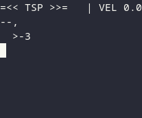<br><a href="default/tsp">tsp</a><br>(tristanC)</td>
<td><br><a href="default/lol">lol</a><br>(hellwolf)</td>
</tr>
</table>

### hackage-10-80
<!-- (All of Hackage) -->
<table>
<tr>
<td><a href="hackage/guess2">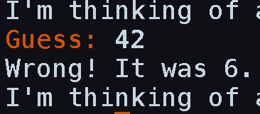<br>guess2</a><br>(sm)</td>
<td><a href="hackage/wordle">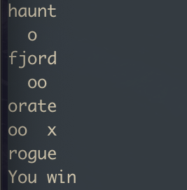<br>wordle</a><br>(halogenandtoast)</td>
<td><a href="hackage/ski">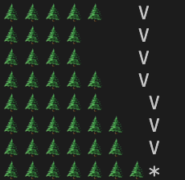<br>ski</a><br>(sm)</td>
<td><a href="hackage/guesscolor">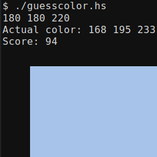<br>guesscolor</a><br>(TravisCardwell)</td>
<td><a href="hackage/bulls-n-cows">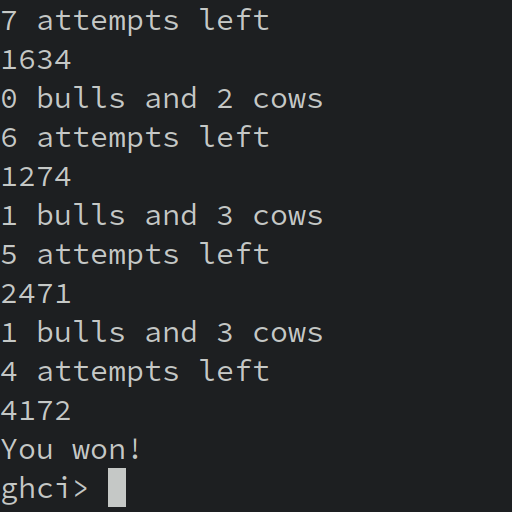<br>bulls-n-cows</a><br>(akadude)</td>
</tr>
<tr>
<td>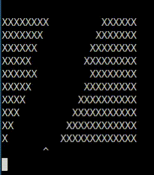<br><a href="hackage/hallway-to-hell">hallway-to-hell</a><br>(juliendehos)</td>
<td><a href="hackage/1234-hero">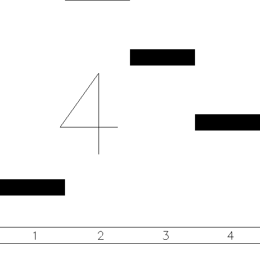<br>1234-hero</a><br>(gelisam)</td>
<td><a href="hackage/crappy-flappy">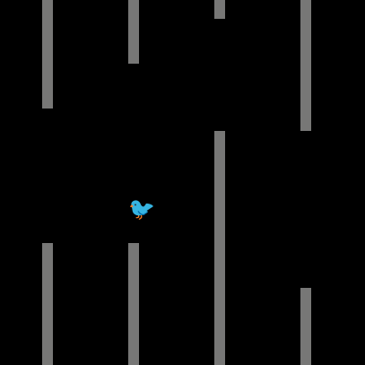<br>crappy-flappy</a><br>(gergoerdi)</td>
<td><a href="hackage/pong">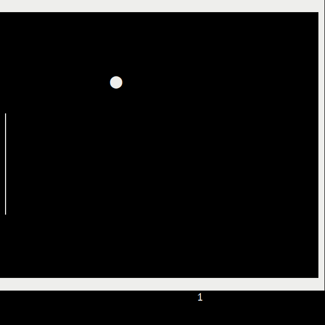<br>pong</a><br>(gergoerdi)</td>
<td><a href="hackage/minesweeper">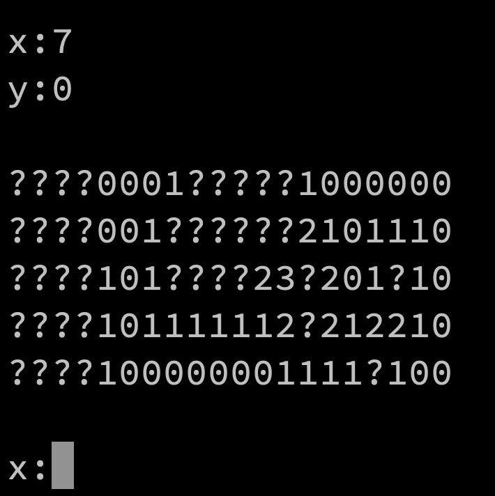<br>minesweeper</a><br>(Greg8128)</td>
</tr>
<tr>
<td><a href="hackage/pong2">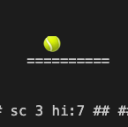<br>pong2</a><br>(sm)</td>
<td><a href="hackage/brickbreaker">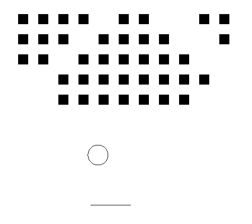<br>brickbreaker</a><br>(fgaz)</td>
<td><br><a href="hackage/lazy-march">lazy-march</a><br>(tristanc)</td>
<td><a href="hackage/balances"><br>balances</a><br>(sm)</td>
<td><a href="hackage/vaders">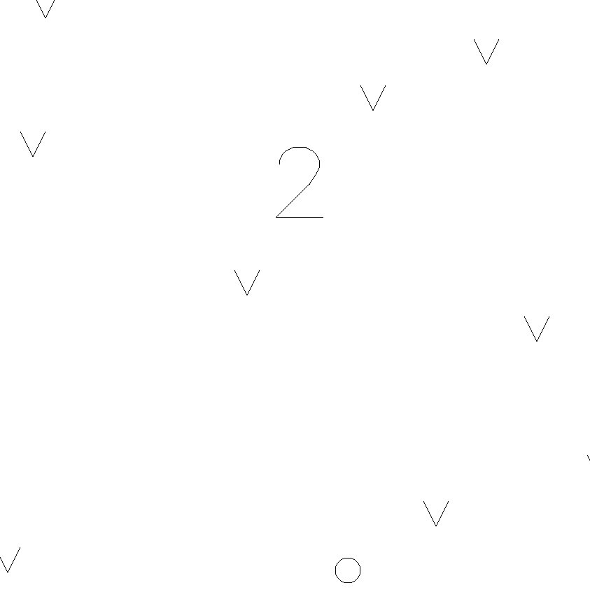<br>vaders</a><br>(gergoerdi)</td>
</tr>
<tr>
<td><a href="hackage/tetris"><br>tetris</a><br>(gergoerdi)</td>
<td><a href="hackage/short-guess">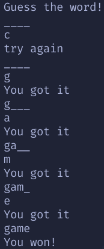<br>short-guess</a><br>(RimuhRimu)</td>
<td><a href="hackage/7up7down">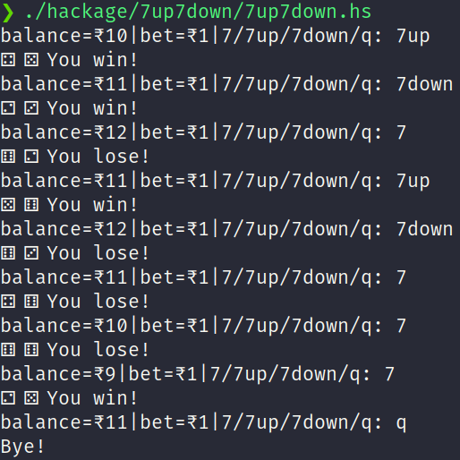<br>7up7down</a><br>(akshaymankar)</td>
<td><a href="hackage/hexEscape">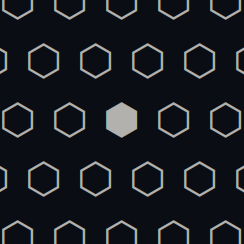<br>hexEscape</a><br>(nevrome)</td>
</tr>
</table>

## Let's play!

You will need a suitable version of GHC (9.2.5+ or 9.4.4+ recommended), and stack (or cabal).
See <https://www.haskell.org/get-started/>.
Once Haskell is installed, and if you have bash, you can run `./play` in this repo:

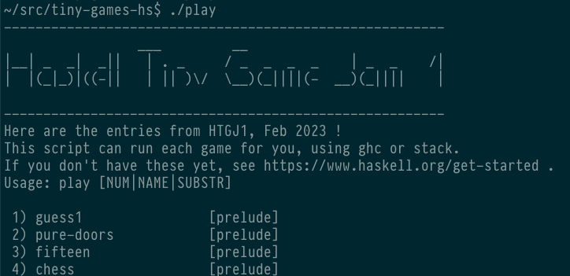

or:

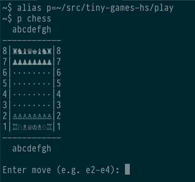

If you don't have bash, cd into each `*/GAME` directory and try running `GAME.hs`.
If that fails, look for running clues in that file, a readme, or the `play` script.
You can also run `./play GAME -h` to view a game's source code and readme.

## Development

### Runnability

- Avoid requiring problematic GHC versions. In particular GHC <9.2 doesn't work well on mac.
   If you specify a GHC version/stackage snapshot, the current release is ideal (GHC 9.2, lts-20).
- env -S in the shebang line doesn't work on older GNU/Linux systems, but we allow it
   (see https://github.com/haskell-game/tiny-games-hs/issues/25).
- stack scripts can seem to hang at first startup while downloading snapshot info.
   For prelude/base/default categories, using --resolver=ghc-9.2.5 avoids this
   (see https://github.com/haskell-game/tiny-games-hs/issues/38).
- stack scripts can use --verbosity=error to silence the "Selected resolver" output.
  (Or --verbosity=info to show dependency building progress.)
- If using packages which require compilation (gloss) or more speed, use stack script --compile or stack script --optimize.
  (Downsides: creates .o and .hi files; a compiled binary with newer timestamp than source can cause confusion.)
- cabal scripts are also welcome; they don't have --compile and require more lines (unless you use env -S)
- On mac, Terminal and iTerm 3.4 render emojis very slowly; iTerm 3.5 beta or VS Code terminal work better.

### Minifying

Here are some minifiers you can try; either or both may be able to turn your game into
a brick of inscrutable code no more than 80 characters wide. Both require that you first
add curled braces and semicolons throughout your code to make it white space insensitive.

- [minify.hs](minify.hs) (from haskell-game/tiny-games-hs#14; contact @kindaro with issues/feedback)
- [hackage/brickbreaker/minify.hs](hackage/brickbreaker/minify.hs) (from haskell-game/tiny-games-hs#63; contact @fgaz)

### Animations

Here's one way to make animated GIFs or APNGs for your README (see also [ski/Makefile](hackage/ski/Makefile)):

```
# Install Noto Emoji font, required by agg to show emojis
$ asciinema rec game.cast
$ agg -v --cols 80 --rows 25 --font-family 'Essential PragmataPro' --font-size 16 game.cast game.lg.gif
$ gifsicle -V --lossy=50 -k8 -O2 -Okeep-empty game.gif -o game.gif
$ gif2apng game.gif game.png
```

agg doesn't show colour emojis [yet](https://github.com/asciinema/agg/issues/2).
The Noto Emoji glyphs are monochrome and less pretty, but will give the idea.
(asciicast2gif which predates agg does show colour emojis, but doesn't convert ansi-terminal-game output well.)

Shrinking the gif, eg with gifsicle, is recommended for repo longevity and page load times.
It helps gif2apng a lot also.

[APNGs](https://github.com/haskell-game/tiny-games-hs/issues/70) are preferable if you can manage it:
they will not be obscured by Github's gif player button, they can be hyperlinks, and they can have smaller file size.
https://sourceforge.net/projects/gif2apng works well, it can be built from its source tarball.
