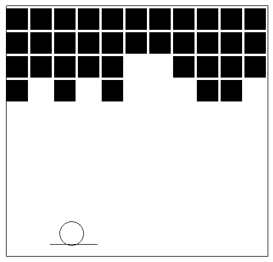

# Haskell Tiny Game Jam

Inspired by the [BASIC 10Liner contest](https://www.homeputerium.de) (see their english rules at the bottom):
the first Haskell tiny games contest runs through February 2023!
The prize.. glory! <!-- and advancing the Haskell game dev craft -->

[Matrix]: https://matrix.to/#/#haskell-game:matrix.org
[IRC]:    https://web.libera.chat/#haskell-game

Submit your entries now (as many as you like) to this repo
(send a pull request, or push if you have access),
or paste in the #haskell-game chat ([Matrix] or [IRC]) and we'll commit for you.
sm and f-a are your judges, informed by #haskell-game.

## Rules

Here are the general rules for this round:

1. Make a playable game in one haskell file of up to 10 lines of up to 80 characters each.

2. This can be a [runghc], [stack] or [cabal] script, or a small haskell program, but not a multi-file project.
   Some templates are provided to give ideas.
   Our ideal is a self-contained 10 line program that just works, like BASIC programs.

3. Unlimited comments are permitted after line 11.
   The game's "category/name (author)" info should appear here,
   and any essential info like player controls, so the game is usable
   to someone seeing just this file, eg in chat.

4. Achieving programs that "just work" is a core principle and part of the challenge.
   The script or program must either
   - be reliably runnable via shebang line (shebang lines are counted as code, but will impress the judges)
   - or contain a reliable build/run command line with all needed options, in the comments
     (the `play` script will use this).

   Entries which aren't straightforward to run are incomplete. Some tips:
   - Avoid requiring problematic GHC versions. In particular GHC <9.2 doesn't work well on mac.
     If you specify a GHC version/stackage snapshot, the current release is ideal (GHC 9.2, lts-20).
   - env -S in the shebang line doesn't work on older GNU/Linux systems, but we allow it
     (see https://github.com/haskell-game/tiny-games-hs/issues/25).
   - stack scripts can seem to hang at first startup while downloading snapshot info.
     For prelude/base/default categories, using --resolver=ghc-9.2.5 avoids this
     (see https://github.com/haskell-game/tiny-games-hs/issues/38).
   - stack scripts can use --verbosity=error to silence the "Selected resolver" output.
   - if using packages which require compilation (gloss), use stack script --compile
   - cabal scripts are welcome but don't have --compile and require more lines (or, use env -S)

5. The game should be portable, running on all major platforms, ideally.

6. A small square screenshot must be provided, ideally static and non-gif.
   (Not animated, because Github's player overlay will obscure it.
   Not a gif, because you can't make those clickable on Github it seems.)

7. A README file is optional but makes browsing your game more pleasant for website visitors.
   Feel free to include animations, or discussion of the game/code/your experience.

8. A less-minified version of the code, that we can learn from, is optional but welcome.

9. Contest entries will be collected in the official repo (haskell-game/tiny-games-hs).
   You can update your entries freely until the contest end, 2023-02-28 11:59:59 UTC,
   at which time they are frozen for posterity and judging (no exceptions).
   If you need to share post-contest improvements, you are welcome to publish as new files in the same directory.

10. You can submit any number of entries, in the following categories:

   **`prelude-10-80`**
   : No imports may be used. ([template1](prelude/template1.hs))

   **`base-10-80`**
   : Imports from the base package may be used. ([template1](base/template1.hs))

   **`default-10-80`**
   : Packages installed by default with GHC may be used.
     Also a second file named Import.hs may be used to gather and re-export imports, only.
    ([template1](default/template1.hs))

   **`hackage-10-80`**
   : All packages on Hackage may be used, and an Import.hs file may be used. ([template1](hackage/template1.hs))

[runghc]: https://downloads.haskell.org/ghc/latest/docs/users_guide/runghc.html
[stack]:  https://docs.haskellstack.org/en/stable/script_command
[cabal]:  https://cabal.readthedocs.io/en/3.6/cabal-commands.html#cabal-v2-run

## Games

Here are the entries received so far:

### prelude-10-80
<table>
<tr>
<td><a href="prelude/guess1"> guess1</a> (sm)</td>
<td><a href="prelude/pure-doors"> pure-doors</a> (tristanC)</td>
<td><a href="prelude/fifteen"> fifteen</a> (bradrn)</td>
<td><a href="prelude/chess"> chess</a> (fizruk)</td>
</tr>
<tr>
<td><a href="prelude/sudoku"> sudoku</a> (elderephemera)</td>
<td> <a href="prelude/matchmaking">matchmaking</a> (migmit)</td>
<td> <a href="prelude/tiny-brot">tiny-brot</a> (tristanC)</td>
<td> <a href="prelude/mini-othello/mini-othello.hs">mini-othello</a> (hellwolf)</td>
</tr>
<tr>
<td><a href="prelude/one-dot"> one-dot</a> (OsePedro)</td>
</tr>
</table>

### base-10-80
<table>
<tr>
<td><a href="base/timing"> timing</a> (TravisCardwell)</td>
<td><a href="base/shoot"> shoot</a> (migmit)</td>
<td><a href="base/log2048"> log2048</a> (Lysxia)</td>
<td><a href="base/rhythm"> rhythm</a> (elderephemera)</td>
</tr>
<tr>
<td><a href="base/peyton-says"> peyton-says</a> (gergoerdi)</td>
</tr>
</table>

### default-10-80
<table>
<tr>
<td><a href="default/type-and-furious"> type-and-furious</a> (lsmor)</td>
</tr>
</table>

### hackage-10-80
<table>
<tr>
<td><a href="hackage/guess2"> guess2</a> (sm)</td>
<td><a href="hackage/wordle"> wordle</a> (halogenandtoast)</td>
<td><a href="hackage/ski"> ski</a> (sm)</td>
<td><a href="hackage/guesscolor"> guesscolor</a> (TravisCardwell)</td>
</tr>
<tr>
<td><a href="hackage/bulls-n-cows"> bulls-n-cows</a> (akadude)</td>
<td> <a href="hackage/hallway-to-hell">hallway-to-hell</a> (juliendehos)</td>
<td><a href="hackage/1234-hero"> 1234-hero</a> (gelisam)</td>
<td> <a href="hackage/crappy-flappy">crappy-flappy</a> (gergoerdi)</td>
</tr>
<tr>
<td><a href="hackage/pong"> pong</a> (gergoerdi)</td>
<td><a href="hackage/minesweeper"> minesweeper</a> (Greg8128)</td>
<td><a href="hackage/pong2"> pong2</a> (sm)</td>
<td><a href="hackage/brickbreaker"> brickbreaker</a> (fgaz)</td>
</tr>
<tr>
<td> <a href="hackage/lazy-march">lazy-march</a> (tristanc)</td>
</tr>
</table>

## Let's play!

You will need a suitable version of GHC (9.2.5+ or 9.4.4+ recommended), and stack (or cabal).
See <https://www.haskell.org/get-started/>.
Once Haskell is installed, and if you have bash, you can run `./play` in this repo:

or:

If you don't have bash, cd into each game's directory and try running the game's .hs file.
If that fails, look for run/build instructions in that file or a nearby readme.

## Development Tools

### Minifier

Since  haskell-game/tiny-games-hs#14, we have a [minifier](minify.hs) that can turn your game into a brick of inscrutable code no more than 80 characters wide, provided that you add curled braces and semicolons over all your program, so that it becomes white space insensitive. @kindaro is the owner of the minifier, ping him with your reviews and suggestions.
