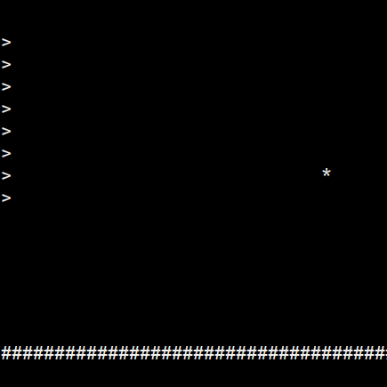

# Haskell Tiny Game Jam

Inspired by the [BASIC 10Liner contest](https://www.homeputerium.de) (see their english rules at the bottom):
the first Haskell tiny games contest runs through February 2023!
The prize.. glory! <!-- and advancing the Haskell game dev craft -->

[Matrix]: https://matrix.to/#/#haskell-game:matrix.org
[IRC]:    https://web.libera.chat/#haskell-game

Submit your entries now (as many as you like) to this repo
(send a pull request, or push if you have access),
or paste in the #haskell-game chat ([Matrix] or [IRC]) and we'll commit for you.
sm and f-a are your judges, informed by #haskell-game.
Here are the general rules for February:

1. Make a playable game in one haskell file of up to 10 lines of up to 80 characters each.
2. This can be a [runghc], [stack] or [cabal] script, or a small haskell program, but not a multi-file project.
   Some templates are provided to give ideas.
   Our ideal is a self-contained 10 line program that just works, like BASIC programs.
3. Unlimited comments and notes are permitted after line 11.
   The game's "category/name (author)" info should appear here.
4. The script or program must either be executable and run reliably (eg like a stack script),
   or it must contain reliable build instructions (eg a ghc command line with all needed package options).
   Entries which aren't straightforward to run are incomplete.
5. The game must be accompanied by a small square screenshot, ideally static and non-gif.
   (Not animated, because Github's player overlay will obscure it. 
   Not a gif, because you can't make those clickable on Github it seems.)
6. The game should run on all major platforms, ideally.
7. Contest entries will be collected in this repo.

Tips for rule 4 (runnability):
- Avoid arguments on the shebang line and `env -S`, which is not available on
  GNU/Linux, or at least not before coreutils 9.x. (Open issue: https://github.com/haskell-game/tiny-games-hs/issues/25)
- Avoid requiring problematic GHC versions, in particular GHC 9.0 which doesn't run on mac
  (and stackage lts-19). If you specify a GHC version/stackage snapshot, the current release
  is ideal (GHC 9.2, lts-20).

[runghc]: https://downloads.haskell.org/ghc/latest/docs/users_guide/runghc.html
[stack]:  https://docs.haskellstack.org/en/stable/script_command
[cabal]:  https://cabal.readthedocs.io/en/3.6/cabal-commands.html#cabal-v2-run

Compete in any or all of these categories:

## prelude (gam-10-80-hs-prelude)

- Only the standard prelude may be used (no imports). ([template1](prelude/template1.hs))

<table><tr>
<td><a href="prelude/guess1"><br>guess1</a><br>(sm)</td>
<td><a href="prelude/pure-doors"><br>pure-doors</a><br>(tristanC)</td>
<td><a href="prelude/fifteen"><br>fifteen</a><br>(bradrn)</td>
<td><a href="base/chess"><br>chess</a><br>(fizruk)</td>
</tr></table>

## base (gam-10-80-hs-base)

- Imports from the base package may be used. ([template1](base/template1.hs))

<table><tr>
<td><a href="base/timing"><br>timing</a><br>(TravisCardwell)</td>
<td><a href="base/shoot"><br>shoot</a><br>(migmit)</td>
<td><a href="base/log2048"><br>log2048</a><br>(Lysxia)</td>
<td><a href="base/rhythm"><br>rhythm</a><br>(elderephemera)</td>
</tr></table>

## default (gam-10-80-hs-default)

- All packages installed by default with the tested ghc version may be used. ([template1](default/template1.hs))
- A second file named Import.hs may be used, to gather imports and re-exports (only).

## hackage (gam-10-80-hs-hackage)

- As above, but all packages released on Hackage may be used. ([template1](hackage/template1.hs))

<table>
<tr>
<td><a href="hackage/guess2"><br>guess2</a><br>(sm)</td>
<td><a href="hackage/wordle"><br>wordle</a><br>(halogenandtoast)</td>
<td><a href="hackage/ski"><br>ski</a><br>(sm)</td>
<td><a href="hackage/guesscolor"><br>guesscolor</a><br>(TravisCardwell)</td>
</tr>
<tr>
<td><a href="hackage/bulls-n-cows"><br>bulls-n-cows</a><br>(akadude)</td>
<td><br><a href="hackage/hallway-to-hell">hallway-to-hell</a><br>(juliendehos)</td>
<td><a href="hackage/1234-hero"><br>1234-hero</a><br>(gelisam)</td>
<td><br><a href="hackage/crappy-flappy">crappy-flappy</a><br>(gergoerdi)</td>
</tr>
<tr>
<td><a href="hackage/pong"><br>pong</a><br>(gergoerdi)</td>
</tr>
</table>

## Let's play!

You will need a suitable version of GHC (8.10.7+, 9.2.5+, or 9.4.4+ are good bets), and stack (or cabal).
See <https://www.haskell.org/get-started/>.
Once Haskell is installed, and if you have bash, you can run `./play` in this repo:
```
~/src/tiny-games-hs$ ./play
--------------------------------------------------------
                 ___         __                          
|__| _  _|  _||   | . _     / _  _  _  _    | _  _    /| 
|  |(_|_)|((-||   | || )\/  \__)(_||||(-  __)(_||||    | 

--------------------------------------------------------
Here are the entries from HTGJ1, Feb 2023 !
This script can run each game for you, using ghc or stack
(if you don't have these yet, see https://www.haskell.org/get-started).
Most games will return here on exit (others will require CTRL-c).

 1) prelude/guess1/guess1.hs
 2) prelude/pure-doors/pure-doors.hs
 3) prelude/fifteen/fifteen.hs
 4) prelude/chess/chess.hs
 5) base/timing/timing.hs
 6) base/shoot/shoot.hs
 7) base/log2048/log2048.hs
 8) base/rhythm/rhythm.hs
 9) hackage/guess2/guess2.hs
10) hackage/wordle/wordle.hs
11) hackage/ski/ski.hs
12) hackage/guesscolor/guesscolor.hs
13) hackage/bulls-n-cows/bulls-n-cows.hs
14) hackage/hallway-to-hell/hallway-to-hell.hs
15) hackage/1234-hero/1234-hero.hs
16) hackage/crappy-flappy/crappy-flappy.hs
17) hackage/pong/pong.hs
18) Quit
** Enter a number to select, or press enter to see the list again: 
```
If you don't have bash, cd into each game's directory and try running the game's .hs file.
If that fails, look for run/build instructions in that file or a nearby readme.

## Development Tools

### Minifier

Since  haskell-game/tiny-games-hs#14, we have a [minifier](minify.hs) that can turn your game into a brick of inscrutable code no more than 80 characters wide, provided that you add curled braces and semicolons over all your program, so that it becomes white space insensitive. @kindaro is the owner of the minifier, ping him with your reviews and suggestions.
