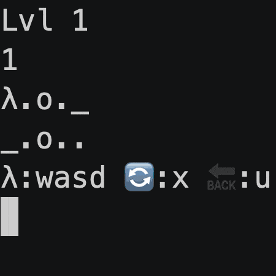
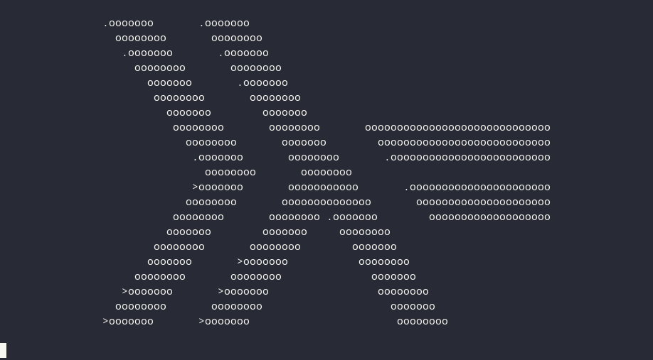
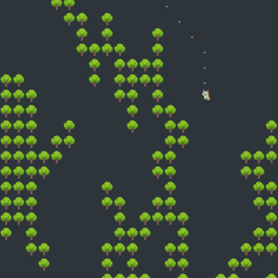
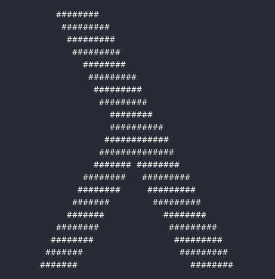
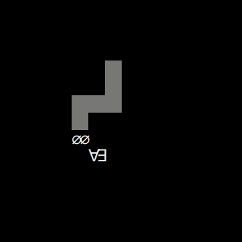

# Haskell Tiny Game Jam


The first Haskell tiny games contest took place in February 2023,
inspired by the [BASIC 10Liner contest](https://www.homeputerium.de) (see also [their 2023 entries](https://gkanold.wixsite.com/homeputerium/games-list-2023)).
f-a linked that in the #haskell-game chat, sm got nerd-sniped and set up the contest, and Haskell game devs showed up in force.
Our mission was to make playable games in 10 lines of 80 characters of Haskell.
The prize.. Glory!
Also fun, learning, and advancing Haskell's suitability for game dev and programming in the small.
The contest ran from 2023-02-07 to 2023-02-28 23:59:59 UTC and the results were announced on 2023-03-10.

<div align=center>

| [Games](#games)
| [Results](#results)
| [How to play](#lets-play)
| [Contest rules](#contest-rules)
| [Development tips](#development-tips)
| [Discussion](#discussion)
|

</div>

## Games

Here are all the entries, by category and submission order, with links to their README if any!
For reviews and judges' picks, keep scrolling.

### prelude-10-80

In this category, no imports were allowed.

<table>
<tr>
<td><a href="prelude/guess1"><br>guess1</a><br>(sm)</td>
<td><a href="prelude/pure-doors"><br>pure-doors</a><br>(tristanC)</td>
<td><a href="prelude/fifteen"><br>fifteen</a><br>(bradrn)</td>
<td><a href="prelude/chess"><br>chess</a><br>(fizruk)</td>
<td><a href="prelude/sudoku"><br>sudoku</a><br>(elderephemera)</td>
</tr>
<tr>
<td><br><a href="prelude/matchmaking">matchmaking</a><br>(migmit)</td>
<td><br><a href="prelude/tiny-brot">tiny-brot</a><br>(tristanC)</td>
<td><br><a href="prelude/mini-othello/mini-othello.hs">mini-othello</a><br>(hellwolf)</td>
<td><a href="prelude/one-dot"><br>one-dot</a><br>(OsePedro)</td>
<td><a href="prelude/expressit"><br>expressit</a><br>(Greg8128)</td>
</tr>
<tr>
<td><a href="prelude/life"><br>life</a><br>(Rens van Hienen)</td>
<td><br><a href="prelude/call-by-push-block">call-by-push-block</a><br>(cole-k)</td>
<td><a href="prelude/companion"><br>companion</a><br>(Greg8128)</td>
<td><a href="prelude/hangman"><br>hangman</a><br>(kukimik)</td>
<td><a href="prelude/quine"><br>quine</a><br>(tristanC)</td>
</tr>
</table>

### base-10-80

In this category, imports from the base package were allowed.

<table>
<tr>
<td><a href="base/timing"><br>timing</a><br>(TravisCardwell)</td>
<td><a href="base/shoot"><br>shoot</a><br>(migmit)</td>
<td><a href="base/log2048"><br>log2048</a><br>(Lysxia)</td>
<td><a href="base/rhythm"><br>rhythm</a><br>(elderephemera)</td>
<td><a href="base/peyton-says"><br>peyton-says</a><br>(gergoerdi)</td>
</tr>
<tr>
<td><a href="base/acey-deucey"><br>acey-deucey</a><br>(trevarj)</td>
<td><a href="base/flower-seeds"><br>flower-seeds</a><br>(tristanC)</td>
<td><br><a href="base/lambda-ray">lambda-ray</a><br>(tristanC)</td>
<td><a href="base/7up7down"><br>7up7down</a><br>(akshaymankar)</td>
<td><a href="base/snake"><br>snake</a><br>(akshaymankar)</td>
</tr>
<tr>
<td><a href="base/woosh">woosh.caves</a><br>(Kindaro)</td>
<td><a href="base/woosh">woosh.forest</a><br>(Kindaro)</td>
</tr>
</table>

### default-10-80

In this category, imports from GHC's default packages were allowed, plus an optional `Import.hs` file for import declarations.

<table>
<tr>
<td><a href="default/type-and-furious"><br>type-and-furious</a><br>(lsmor)</td>
<td><a href="default/shmupemup"><br>shmupemup</a><br>(elderephemera)</td>
<td><br><a href="default/tsp">tsp</a><br>(tristanC)</td>
<td><br><a href="default/lol">lol</a><br>(hellwolf)</td>
<td><a href="default/space-invaders"><br>space-invaders</a><br>(meooow25)</td>
</tr>
<tr>
<td><a href="default/swish">swish.easy</a><br>(Kindaro)</td>
<td><a href="default/swish">swish.survival</a><br>(Kindaro)</td>
<td><a href="default/lc"><br>lc</a><br>(byorgey)</td>
</tr>
</table>

### hackage-10-80

In this category, imports from all of Hackage were allowed, plus an optional `Import.hs` file for import declarations.

<table>
<tr>
<td><a href="hackage/guess2"><br>guess2</a><br>(sm)</td>
<td><a href="hackage/wordle"><br>wordle</a><br>(halogenandtoast)</td>
<td><a href="hackage/ski"><br>ski</a><br>(sm)</td>
<td><a href="hackage/guesscolor"><br>guesscolor</a><br>(TravisCardwell)</td>
<td><a href="hackage/bulls-n-cows"><br>bulls-n-cows</a><br>(akadude)</td>
</tr>
<tr>
<td><br><a href="hackage/hallway-to-hell">hallway-to-hell</a><br>(juliendehos)</td>
<td><a href="hackage/1234-hero"><br>1234-hero</a><br>(gelisam)</td>
<td><a href="hackage/crappy-flappy"><br>crappy-flappy</a><br>(gergoerdi)</td>
<td><a href="hackage/pong"><br>pong</a><br>(gergoerdi)</td>
<td><a href="hackage/minesweeper"><br>minesweeper</a><br>(Greg8128)</td>
</tr>
<tr>
<td><a href="hackage/pong2"><br>pong2</a><br>(sm)</td>
<td><a href="hackage/brickbreaker"><br>brickbreaker</a><br>(fgaz)</td>
<td><br><a href="hackage/lazy-march">lazy-march</a><br>(tristanC)</td>
<td><a href="hackage/balances"><br>balances</a><br>(sm)</td>
<td><a href="hackage/vaders"><br>vaders</a><br>(gergoerdi)</td>
</tr>
<tr>
<td><a href="hackage/tetris"><br>tetris</a><br>(gergoerdi)</td>
<td><a href="hackage/short-guess"><br>short-guess</a><br>(RimuhRimu)</td>
<td><a href="hackage/hexescape"><br>hexescape</a><br>(nevrome)</td>
<td><a href="hackage/snake-lemma"><br>snake-lemma</a><br>(gergoerdi)</td>
<td><a href="hackage/subpar-hexagon"><br>subpar-hexagon</a><br>(gergoerdi)</td>
</tr>
</table>

## Results

<!-- announcement -->
We are very pleased to announce.. the results of Haskell Tiny Game Jam 2023 !
Congratulations and thanks to all participants!

- 55 entries in 4 categories from 28 entrants in 3 weeks
- 109 reviews, 5 winners and 6 honourable mentions from 2 judges
- Shell script to browse and play the games on all major platforms (single binary coming later maybe)
- Readable source versions, useful development tips, informative blog posts

This was the first Haskell game dev contest. We invite you to come and play, read, and get inspired for the next one!

<!-- https://github.com/haskell-game/tiny-games-hs -->
<!-- end announcement -->

Creating a 10-line tiny game in Haskell and shipping a contest entry is a non-trivial task.
If you succeeded, double congratulations!
You are one of very few people in the world who could complete this task in the next few hours.

The judges were sm and f-a.
Below you will find our reviews, by category and submission order, followed by the contest winners.
Our ratings aimed to reflect playable and fun Haskell tiny games satisfying the contest rules.
With single ratings and human biases, judging will of course be imperfect.
We invite the players to try all games, as the selection is impressive.
More:

**sm**:

- I highly value games that caused me to experience Fun.
  Good feel, gameplay, challenge, replayability, etc. all help.
- I have a fondness for real-time action/arcade games, which in my early programming days
  were always the most rare, desirable, exciting and difficult to achieve.
- I value games that are easy to get started with.
  So, if documentation must be used, I appreciate it being there and being clear.
- I highly value games that are straightforward to install and that just work.
  This was mostly ensured before the deadline, so wasn't often factor in the judging.
- I value the creativity, innovation and extreme cleverness required
  to deliver these things in a tiny package!
  
**f-a**:

- The trifecta of game-making is: running without fuss; clear controls; fun to play!
- In a ten-liner, cornes have to be cut and decision have to be made, so I try to understand
  what the developers had in mind and how they balanced those factors. 
- Innovation, immersion and efficient usage of scarce means are welcome.

`ratings.tsv` has a summary of the ratings, or run `./getratings` to see another view.

<!--
ratingstsv.hs depends on the following START and END comments,
the level of headings and the format of **nick:** and Rating: lines.
-->
<!-- START -->

### Prelude

#### guess1 (sm)

**f-a:**
what can I say, it is a short game… Probably the
shortest of the competition. Also could be sold for hundreds
of euros as a postmodernist installation.
Rating: N/A, judge made.

**sm:**
The most minimal "game" I could think of, just a demo/template while setting up the contest.
Also the most unbeatable game in the collection; the only winning move is not to play.
Rating: my entry

#### pure-doors (tristanC)

**f-a:**
A vertical type of Angry Birds game. I actually enjoyed
this a lot; a fun way to play this is to
start a metronome (or your favourite song) and “play to the beat”,
i.e. force yourself to press one key per beat (or measure, if the
song is fast).
Cute, ASCII, contained in nine lines, thumbs up for me.
Rating: 6/10

**sm:**
A turn-based piloting game (I think of it as a minimal Zaxxon).
use JKL and ENTER to steer your ship through narrow gaps in a series of walls.
Nicely documented, read the docs for best scoring.
See also the dev write-up at <https://tristancacqueray.github.io/blog/tiny-game-engine>.
Rating: 6/10

#### fifteen (bradrn)

**f-a:**
Excellent user experience on this one: controls explained in-game,
a clean & cosy interface, lisergic amount of ‘:’ in the code.
Fifteen is always a nice puzzle and this implementation does it
justice.
Rating: 7/10

**sm:**
The sliding fifteen tiles puzzle. The tiles start out mostly ordered,
which threw me off - I expected to see a randomised layout. 
But in fact the last row is misordered.
I'm not sure how difficult this is to solve.. more than enough for me.
Seems to work by a ton of clever pattern matching.
Rating: 7/10

#### chess (fizruk)

**f-a:**
Not a game but a chessboard implementation. Rules are not
there — obviously you cannot expect “en passant” in a ten-liner — so
you can more your e pawn to the eight rank on the first move!
(Sadly, it cannot be promoted.) Eleven-liner, not a tenner.
Rating: 5/10

**sm:**
Not a single-player game, but a working chess board for two human players.
Uses unicode chess glyphs.
Not documented except in the [PR](https://github.com/haskell-game/tiny-games-hs/pull/26),
but fairly self explanatory.
Rating: 7/10

#### 🔷 sudoku (elderephemera)

**f-a:**
Tremendous effort to have a sudoku implementation in 796 characters.
This has: a generator (which takes some seconds to some minutes, be
patient), a game-mode and a solver too, quite remarkable!
Interface is clean (it warns you of mistakes and you can even type
’.’ to erase a cell — what more do you want?), README informative.
Rating: 8/10

**sm:**
A sudoku puzzle generator and solver.
Nicely documented, although without a readable source version.
Seed 0 produces a nice easy puzzle - if you can fill in all spaces
without any turning red, you have solved it.
Seed 2 makes it churn for a long time - impressive number crunching
from such a tiny game - does that mean a more difficult puzzle ?
Very cool and useful for sudoku fans.
Possibly unique among these games in producing entertainment
you can share to anyone including non-computer users.
Rating: 9/10

#### 🔷 matchmaking (migmit)

**f-a:**
One of the best stories of the competition, which puts you in the
role of a matchmaker in a Hungarian village. Pairing boys and girls
is no small feat, carelessness will lead to a subpar number of
marriages! I enjoyed playing this: novel ideal, excellent theme
description, good documentation and interface. Primo!
Rating: 9/10

**sm:**
A simple puzzle game with a nice back story.
Good player docs; no dev notes or readable source version.
Uses runghc's `-cpp` option to cram more code into the shebang line.
Rating: 6/10

#### tiny-brot (tristanC)

**f-a:**
A seven-liner demo showcasing a fractal. Not a game, but a good
showcase of coding skills. Don’t forget to press <Enter> to zoom
in!
Rating: 6/10

**sm:**
Not a game, but a nifty mandelbrot fractal visualiser. Each press of
ENTER zooms in to show more detail (I think). 
One of the tiniest entries, using only six lines of Haskell code.
See also the dev write-up at <https://tristancacqueray.github.io/blog/tiny-game-engine>.
Rating: 7/10

#### mini-othello (hellwolf)

**f-a:**
This is a remarkable implementation of the classic Othello in just
ten lines of Haskell code. The AI, despite being rudimental, managed
to beat me multiple times. Interface is a bit rough — expected in a
ten-liner — but the README makes up for it.
Very good gaming experience.
Rating: 7/10

**sm:**
An othello game with a reasonable computer opponent ? In ten lines ? Outstanding!
I seemed to see a bug during play when it failed to flip some of my pieces,
but it has not been reproduced. More testers needed, or just User error ?
No readme included but there is some good documentation
in the source, visible with `./play mini-othello -h`,
and fine dev notes published at <http://miaozc.me/2023-02-27-hs-tiny-games.html>.
Rating: 8/10

#### one-dot (OsePedro)

**f-a:**
Very good puzzle game: ASCII representation is clean and uncluttered (other
games print a new board on each move, this one takes the better approach with
a persistent representation), game rules (from the good README) easy to get.
Game is devilishly difficult though! I suggest everyone to start with
a smaller board size.
Rating: 8/10
  
**sm:**
A challenging puzzle game. 
Restore a randomised board to order by flipping 3x3 sections.
Good docs, no readable source version but does come with a description of each function.
Rating: 7/10

#### 🔷 expressit (Greg8128)

**f-a:**
A game that does away from 2D ASCII trickes, refreshing.
The goal is to form valid expressions (in RPN) to reach some kind of
numeric goal.
This takes some time to get used — and a few `stack empty` errors —;
I enjoyed it immensely, it is quite a challenge to compute RPN in
your head, even something simple as `reach 5 from n=7`.
Be sure to check the README before trying to crack more difficult
problems: operands are wild (`c`: collatz function).
Great idea!
Rating: 9/10

**sm:**
A mathematical puzzler. You must create expressions for a stack-based
calculator in order to transform a value to a given target value.
Puzzles increase in difficulty.
No dev notes; fairly good player docs, but I still had trouble
figuring out acceptable entries.
Eg, for n=1, target=1, `n1*` is rejected, but `n` works.
For n=1, target=2, `n2*` is rejected, but `nn+` works.
Rating: 6/10

#### life (Rens van Hienen)

**f-a:**
Implementation of Conway’s game of life. On-screen command hints
are always appreciated by reviewers. Cosy to see your little
civilisation growing up.
Rating: 7/10

**sm:**
The [Game of Life](https://en.wikipedia.org/wiki/Conway%27s_Game_of_Life),
a "zero player game" and the most famous cellular automaton,
where cells live or die based on how many live neighbours they have.
The playing field is blank by default; you should enter t X Y
to enliven some cells, then repeatedly type n ENTER to step the simulation. 
Perhaps a non-stop mode is possible in version 2 ?
Provides on-screen help, unlike many tiny games.
Comes with dev notes in the source file.
Rating: 6/10

#### 🏆🏅 call-by-push-block (cole-k)

**f-a:**
What can I say, a beautiful game which is among the most polished
entries in the competition, from interface to actual gameplay, to
some unholy tricks in the code bending the rules of the
competition.
The comfy factor is amazing: you are introduced to the puzzle bit
by bit, in an effortless manner, discovering clever mechanics
along the way, with a twist on level five that left me speechless
(“How could he manage to fit that in 10 lin- ohhhh”).
Rating: 10/10

**sm:**
A sokoban game with 15 challenging and entertaining levels in 10 lines ?!
Thoughtfully provides level skip codes, as well as on-screen help.
Extensive player notes are provided.
Uses some clever data compression tricks,
explained in a detailed and entertaining dev write-up at <https://www.cole-k.com/2023/02/21/tiny-games-hs>.
Rating: 10/10

#### companion (Greg8128)

**f-a:**
A chatbot which starts from a blank slate and should learn to speak
mimicking your input.  Despite my best effort the conversation was
one sided.
If the author could provide his transcript, that would be a nice way
to showcase how the machine is learning.
Rating: 5/10

**sm:**
A chatbot that learns from your inputs, in seven lines of haskell code.
Pretty cool, but perhaps I wasn't patient enough to see the best results.
If it really will improve, more details of the "training" required, 
or a demo of a trained example, would be motivating.
Rating: 4/10

#### hangman (kukimik)

**f-a:**
A faithful hangman implementation. Uses the same unicode trick of
call-by-push-block to achieve a pleasant guessing experience.
Cute ASCII art.
Rating: 7/10.

**sm:**
A fun hangman game, drawing the hanged man as you make wrong guesses.
I don't know how many words it knows.
Minimal docs. Uses some clever tricks, including unicode-based compression
and the CPP __TIME__ macro.
Rating: 8/10

#### quine (tristanC)

**f-a:**
A quine! I am always fascinated with these, reminds me of Oulipo
literature. This too can go in the “postmodernist” category
Rating: 7/10

**sm:**
A [quine](https://en.wikipedia.org/wiki/Quine_(computing)), which is
a tricksy kind of program that prints exactly its own source code.
Also provides a readable source version.
See also the dev write-up at <https://tristancacqueray.github.io/blog/tiny-game-engine>.
Rating: 7/10

### Base

#### timing (TravisCardwell)

**sm:**
An unusual tiny game: one implemented with perfectly normal, ungolfed haskell code.
As a result, half of the program is boilerplate (shebang, stack line, imports..)
and half implementation. 
This game tests your ability to estimate 30 seconds.
Simple and effective, a good first game to study or to write!
Rating: 6/10

**f-a:**
A surprisingly fascinating game which shows how the barest of mechanics can be
nontheless fun. Your task is simple: press <Enter>, wait 30 seconds, press
<Enter> again. How hard can it be? Still, lot of fun, with my best score
being `You waited 30.39618408700335 seconds`, beat that! Bonus points for
clean code.
Rating: 7/10

#### shoot (migmit)

**sm:**
Our closest entry to Missile Command!
In this game you are the attacker, not the defender.
I think numbers appearing on the bottom line are targets,
to be blasted with rockets from above before they count down to zero.
Instructions are minimal and success/failure is not obvious,
so I was a bit confused.
Rating: 5/10

**f-a:**
A very interesting game with split commands: your left hand to decide
from where to fire and the right one to direct the missles. README is
a tad short and I am not exactly sure what the numbers/`*`/`X` on the
bottom of the screen represents, but the action is solid an I had fun.
Rating: 7/10

#### log2048 (Lysxia)

**sm:**
Not completely self-contained (no room for a shebang line), probably
because of the luxurious use of spaces for readability.
No instructions, which caused me trouble. Here are the ones from an
online 2048 game: "Use your arrow keys to move the tiles. Tiles with
the same number merge into one when they touch. Add them up to reach
2048!"  This one is different, being in base 2, I believe. 
The movement keys are h j k l (VI movement keys ? I think so), plus enter after each press.
Unfortunately like time-pressed reviewers of old, I couldn't figure out
exactly what's going on here. Once you do, I expect it's a nice puzzle game.
Rating: 4/10

**f-a:**
A clone of the famous *2048* game. I had some trouble playing this
as I did not check the original when it came out. The action is a bit
different here, you do not “slide” but more “tilt” the board so *all*
numbers (log₂) move to that side.
Once you get this, it is very fun to try to match numbers together
or try to work them in a position where you can pair them.
Rating: 7/10

#### rhythm (elderephemera)

**sm:**
Guitar Hero in the terminal!
Prompts you for speed (0-9) and "keyset" (0-2) at startup.
Read the help (`./play rhythm -h`) to discover the keys,
or just press the keys that are shown on screen.
You should press only when they are below the hit bar - 
green indicates you are in time (and your score goes up; twice as fast if you are on a winning streak),
red indicates a miss (and your score goes down).
A nice real-time feel.
The game never ends; your score just goes negative.
Suggestion: play a favourite music track along with this game.
Rating: 6/10

**f-a:**
Guitar hero clone and a very fun one! The author managed
to cram in ten lines not only the game, but even multiple keysets
— check the README! — and a “speed” setting.
It plays smooth, it has colours, a score counter; graphically minimal
and clean, thumbs up for me!
Rating: 8/10

#### peyton-says (gergoerdi)

**sm:**
A tiny version of the classic Simon electronic game,
and an homage to our revered general Simon Peyton Jones..
Repeat the ever-growing sequence of digits shown by the game,
for as long as you can.
Not real time - you can take as long as you like for each keypress.
I appreciate that it doesn't require pressing enter.
Alas the random generator needs more platform testing, eg on mac SPJ says nothing but 11111...
Could be a fun brain exercise when fixed.
Rating: 4/10

**f-a:**
A variation on the old Simon game. I had much
fun playing this: it is a surprisingly cosy game, the action
is clear and interesting for longer than most other 10-line
productions.
Rating 7/10

#### acey-deucey (trevarj)

**sm:**
A classic from the BASIC era, discovered by many as the [first game](https://www.atariarchives.org/basicgames/showpage.php?page=2) in David Ahl's BASIC Computer Games (1978).
Nicely documented.
Nice handling of invalid input.
Unfortunately, randomness needs more platform testing, eg on mac Dealer always turns up a 2.
With this fixed, it should be fun.
Rating: 4/10

**f-a:**
A simple gambling game: the dealer will show two cards and you have got to bet
wheter a third hidden one will be “inside” the range of the first two.
I say *have* becuase there is no turning back in acey-deucey, you *always*
have to bet; be considerate and don't gamble your mortage payment on slim
odds.
The game could have benefitted from some kind of clear-screen function (as now
the display is a bit messy), but it is playable and fun while your bankroll
lasts!
Rating: 6/10

#### flower-seeds (tristanC)

**sm:**
Not a playable game; displays a lovely spiral of hearts, for St. Valentine's day.
If only they had been red. :)
Nicely documented, with readable source version and a linked video to study.
See also the dev write-up at <https://tristancacqueray.github.io/blog/tiny-game-engine>.
Nice real-time updating as you adjust parameters.
Rating: 7/10

**f-a:**
A weird ten-liner that I appreciated a lot. It is not really a game, more than
a render/demo of a geometrical shape made out of hearts. What makes it fun is
that you can control the display parameters in real time, interesting to see how
the structure changes.
Rating: 7/10.

#### lambda-ray (tristanC)

**sm:**
Not a playable game; displays a large Haskell-logo lambda,
rotating rather majestically in the terminal.
Nicely documented, with verbose source and links to study.
No shebang line; every one of those 10 lines was needed.
Rating: 8/10

**f-a:**
Another rendering demo, and another one with the haskell logo
(`λ` + `>>=`). There is a fast version and unminified code
explanation which is interesting enough.
Rating: 6/10

#### 7up7down (akshaymankar)

**sm:**
Bet on dice rolls.
You must type "7", "7up", or "7down" each time, which is a little tedious.
Implements game quitting, so you can take your winnings and declare victory.
Nicely documented, with dev notes.
Rating: 6/10

**f-a:**
Another casino game, a simplified version of Craps/Seven-eleven. Eight-liner,
interface is a bit clunky (you need to type your prediction longhand) and dice
icons a bit too small on my terminal. Bonus: unfurled code, taunting if you lose
all of your money.
Rating: 5/10

#### snake (akshaymankar)

**sm:**
A turn-based snake game. The snake gets longer when it eats the thing.
The play area wraps around, and there's no dying, so it's more of a relaxation than a game.
Nicely documented, including notes on real snakes.
Rating: 6/10

**f-a:**
Snake clone. Since it is not in real time you will enjoy this better if you can
play to your metronome or some kind of fast-tempo music. Fun part: the snake
can cross itself without dying.
Rating: 6/10

#### 🏅 woosh.caves (Kindaro)

**sm:**
The first of several variants of a cave-diving game (woosh.* and swish.*).
How far can you go, avoiding walls and dead ends within a fiendish cave system ?
Note the cave shape is persistent, so you can learn it to progress farther.
woosh is turn-based, not requiring fast reflexes. a s d to steer left, down or right.
In woosh you can Hold the key to engage afterburners - useful for familiar regions!
Not much documentation but includes an unminified source version for study.
Uniquely among these tiny games, woosh (and swish) come with a build script
which can generate and minify new game variants based on a config file. 
Uses some non-roman unicode glyphs as abbreviations, which look cool (and might be mnemonic ?)
Rating: 9/10

#### woosh.forest (Kindaro)

**sm:**
Another variant of woosh, using double-width emoji characters.
If you are in a terminal with a nice emoji-supporting font, you will be a cute kitty wandering through a forest.
I wasn't able to get very far through this forest - is there a path I've missed ?!
Rating: 7/10

**f-a:**
This is a ski/descent/avoid type of game which greatly
benefits from its procgen algorithm. The task is simple, descending in a deep forest
(with many many many intricated paths) while avoiding hitting the trees themselves.
The “trails” (in woosh.caves = caverns) shape is what makes this game unique and enjoyable.
They are really nicely plotted and unique to look at, so much that I took pauses
— no need to pause actually, it is a turn based game — to admire the scenery.
Sometimes you select the wrong road, and realise only after that keypress that there
is no exit. You are then hopelessly guiding your feline to an untimely death; a more
developed and touching plotline than 95%+ of Steam games.
Rating: 8/10

### Default

#### type-and-furious (lsmor)

**sm:**
A typing speed test! How fast can you type the letters a to z ?
I had some doubt about rules; the readme says
"Alphabet should be written in order, without failure."
Command line flags are supported, selecting four difficulty levels, allowing 10 seconds to 3 seconds.
When time is up you'll be shown what you typed, and a percentage score.
Simple and stressful!
Rating: 6/10
  
**f-a:**
A game where you have to have to type the English alphabet, in order,
without failure, in the allotted time. There are four difficulty levels
and I failed multiple time at the easiest one. Anxiety inducing!
Rating: 5/10

#### 🏅 shmupemup (elderephemera)

**sm:**
One of three shoot-em-ups in this contest:
this is an unusually hectic terminal game, a Defender-esque shooter with lots of moving objects, all of them fatal!
It's just as well you are armed with a powerful laser. WASD to move, space to shoot.
Nicely documented with running, playing, and dev notes and a readable source version.
This game very cleverly implements a lot of animation and game logic by 
repeatedly parsing the whole playfield, which is probably key to its small size.
Avoid the slight flaw that it's fairly easy if you hold the fire key and don't move much -
instead dive in and fly as in the [Quantum Asteroid Field](https://youtu.be/5ROiWmnWJHw?t=26)!
Rating: 10/10

**f-a:**
An unicum (horizontal side-scroller) in the competition, `shmupemup`
is packed with action (and artifacts while updating the screen on slower terminals).
It is quite a substantial production for a ten-liner and the interesting README
explains everything in its gory details. The game itself is good to play if a bit too
easy after a while.
Rating: 7/10

#### 🔷 tsp (tristanC)

**sm:**
This is a cool real-time arcade game in essentially one screen line!
Join the Tiny Space Agency and fly your delivery ship to orbit and back as fast as possible.
It won't be comfortable.. it won't be cheap.. but it will be fast. Assuming anything survives your landing.
Nice docs with detailed play instructions and readable code version.
See also the dev write-up at <https://tristancacqueray.github.io/blog/tiny-game-engine>.
A quick and satisfying game to play with plenty of challenge in reaching higher scores.
Rating: 9/10
  
**f-a:**
Cute game in the “thrust” genre. Not immediate from the README, controls are `f` and `r`.
You need to pilot your ship from base, to deliver curry to Tiny Space Station and return back
in one piece.  The only mechanic is “don’t fly too fast or you will crash when landing”,
but it is a very good mechanic and you will feel accomplished succeeding. Among the terminal
games, the layout of this one (a single, long stripe) is unique.
Rating: 7/10

#### lol (hellwolf)

**sm:**
This "game" is in fact an enhancer of other games. In the spirit of the lolcat program,
`lol` can add rainbow colours to the other games in this collection (most but not all of them).
This is rather clever and I don't know how it is done; I assume magic.
Run eg `./play lol ski` to see a basic effect. Additional `lol` arguments give different effects.
Run `./play lol -h` to see the docs,
or see the fine dev notes at <http://miaozc.me/2023-02-27-hs-tiny-games.html>.
Terminal games can look bland, but `lol` adds zest, so try it with your favourite games!
Rating: 9/10
  
**f-a:**
Meme mod for (almost) all terminal games to get that Nyan cat vibe your production deserves.
No readme, imperscrutable code, 100% kaleidoscopic.
Rating: Mondrian/10

#### 🏅 space-invaders (meooow25)

**sm:**
Another shoot-em-up, an homage to the [first in the genre: Space Invaders](https://en.wikipedia.org/wiki/Shoot_%27em_up)!
A and D to move, space to shoot. This tiny version feels good, is instantly recognisable and can still induce panic!
Comes with docs and readable source version.
Quite challenging!
Rating: 9/10
  
**f-a:**
A Space Invaders clone too ambitious for a ten-liner, you say? Not for meooow25! The game
flows nicely, controls are easy to get, screen refreshing not super-smooth but appropriate
to the game setting (a lone man on outdated technology trying to zap alien spaceships,
maybe?). README contains easy-to-follow unminified code (with minified vars reference too!).
It was fun, it was hectic, it felt great to beat it!
Rating: 8/10

#### swish.easy (Kindaro)

**sm:**
Like woosh, swish is about piloting your ship as far as you can through a fiendish (but learnable) cave.
But swish is an honest-to-god exciting fast-paced arcade game.
This "easy" variant is fun and not particularly easy.
The collision detection felt a little unfair in tight spots, or was it just pilot error?!
Minimal documentation, but as with woosh there is an unminified version
and a build script to generate new variants based on a config file.
Rating: 8/10
  
**f-a:**
Very good descent game, you can say a `woosh` with real-time added!
Very fluid action, yet for some reason I preferred the cosyness
of `whoosh`. I believe there are some bugs in the logic as I died
multiple times while adjacent to a block but not overlapping with it. In any
case good production!
Rating: 7/10

#### 🔷 swish.survival (Kindaro)

**sm:**
A more challenging variant of swish, with longer tunnels and more dead ends.
Rating: 9/10
  
**f-a:**
See above.

#### lc (byorgey)

**sm:**
A puzzle game for computer scientists; you are provided a series of 
equations and must define lambda calculus functions to implement them.
I believe it provides about a dozen such puzzles.
Comes with readable source version and good docs, which you will need to study!
See the README or run `./play lc -h`.
I must admit to not completing a level, but I suspect you will find
a rather tough and good brain workout here. Recommend enhancing with lol.
Rating: 7/10
  
**f-a:**
A game similar to `expressit`. You are living the escapist fantasy of
being a computer scientist. Your task? Write lambda calculus terms to
fit the bill.  The premise are interesting, the game itself is *really*
challenging. The author had to use De Bruijn indices (forced choise,
there isn’t a single space wasted in the code!), this was not easy for
me to digest as a player. If you want to enjoy this I recommend
fetching pencil, paper!
Rating: 6/10

### Hackage

#### guess2 (sm)

**f-a:**
N/A judge made, test game.
  
**sm:**
Guess the number. A golfed version of my [first Haskell game](https://hub.darcs.net/simon/guess-the-number/browse/guess-the-number.hs)
(made for the LA Haskell Users Group in 2013).
Rating: my entry

#### wordle (halogenandtoast)

**f-a:**
Only nine readable lines for this beauty, for a game we all love.
Interface could make slightly better by adding a prompt right when the game starts
and/or providing a README. Once you get that, it is quite playable (and replayable,
with nine possible words) and well behaved!
Rating: 6/10

**sm:**
A working game of wordle. 
No docs, no on-screen prompt; just type a word and watch for clues
in the form of o (right letter wrong place) or x (right letter right place).
Could have included more words for more replayability.
Rating: 5/10

#### ski (sm)

**f-a:**
Thrilling, fantastic action-packed game which will not give you a moment to catch your
breath. Control a nameless skier and guide him to avoid his doom. In the README a code guide
and tips for tricky terminals, thumbs up!
Rating: N/A judge made (but recommended)

**sm:**
Of my entries, the one I like playing. Steer left and right with AD.
Best played in a terminal and font which will show a nice tree emoji,
may not look right otherwise.
This is a classic game from BASIC days, traditionally one of the simplest
action games to implement since most machines and languages can scroll
text upward quickly.  Interestingly, on a modern mac that's not true 
in the default Terminal app or the current iTerm release; the emoji
slows it doen horribly. Be sure to use a better terminal app like
iTerm 3.5 beta or newer, or VS Code's terminal.
Rating: my entry
  
#### guesscolor (TravisCardwell)

**f-a:**
Unique game the pack, asking you to guess a colour in its
RGB representation. It is surprisingly tricky (my scores started from 60, slightly
improving each game).
Good idea, would love to use HSL representation too (which I am sure tha author
thought of, but alas only ten lines).
Rating: 6/10

**sm:**
A novel game using gloss to display a color, testing your estimation of its RGB components.
No prompt on the terminal; enter R G B as three space-separated 0-255 numbers.
Like Travis's `timing` entry, this is implemented with perfectly readable unminified
Haskell code.
Rating: 7/10

#### bulls-n-cows (akadude)

**f-a:**
*In medias res* game which might have benefitted from some ingame instructions or a
README. ``bulls-n-cows`` is a guessing game, similar to some tabletop games of the
past. Provides a decent gaming experience once you get the hang of it.
Rating: 6/10

**sm:**
A number guessing game with clues, like wordle for four-digit numbers.
No docs. Enter four digits to see clues, bull means right number right place,
cow means right number wrong place.
Rating: 5/10

#### hallway-to-hell (juliendehos)

**f-a:**
Another — aptly named — “don’t hit the walls” game. Less hectic than `ski`, easier
on your coronaries, more compact than `ski` and without emojis, hence playable on
every terminal.
I praise the minimal (but clear!) README and almost readable minified code.
Rating: 7/10

**sm:**
Another piloting game, unusual in that you are flying upward.
A little flickery as a result but the direction feels natural.
AD keys to move left and right.
The tunnel gets progressively narrower, so there's no winning here.
When you hit a wall the game hangs, not printing a score alas.
The code is readable.
Rating: 6/10

#### 1234-hero (gelisam)

**f-a:**
A very good production, which gets away from the terminal. 1234-hero is a game in
the spirit of *Guitar Hero*. As a judge I liked the clever way of putting controls
infos in the title, clean interface, good mechanics (not easy to press keys on
time!). Excellent!
Rating: 8/10

**sm:**
A graphical rhythm game using gloss. Press 1234 as each note crosses the bar
to increase your score. As you get the timing right it gradually accelerates,
creating a nice rising tension!
Rating: 8/10

#### crappy-flappy (gergoerdi)

**f-a:**
Another game inspired by a classic (*Flappy Bird*), `crappy-flappy` sports
gentle action. It is a one-button game, controls are super easy to get even
without checking the README, and accessible to most. Simple but not trivial,
it felt great guiding the warm-blooded vertebrate to safety.
Rating: 8/10

**sm:**
A nice terminal version of Flappy Bird. 
Feels and looks good, at least with my unicode font.
Simple one-key control: just hammer the space bar to stay aloft and fly across
the screen, through the gaps.
No scoring - game ends when you crash or when you win.
Rating: 7/10

#### pong (gergoerdi)

**f-a:**
Clone of one of the famous games of the past, you start the game with your paddle
almost covering the whole height, but don’t let that trick you: the ball is
fast, your movement slow, it will not be easy to keep the game going.
Rating: 6/10

**sm:**
A nice clean-looking classic pong game, at least with my unicode font.
Bounce the ball against a wall as many times as you can,
using WS keys to move your bat up and down.
Score is displayed in-game and afterward.
Quite challenging - the bat moves slower than the ball,
you'll need to hold down the key but that also speeds up the ball.
I like it!
Rating: 8/10

#### minesweeper (Greg8128)

**f-a:**
Minesweeper clone with clunkyness added, since we do not play with a mouse
but by inputting coordinates on a keyboard. Quite nice that the player can
choose a larger/smaller board and the number of mines (based on how lucky they
feel in that particular day).
Good mechanics explanation (with a “transcript”) in the `.hs` file.
Rating: 5/10

**sm:**
Minesweeper.
Enter width, height, number of mines, then successive x and y coordinates
as you try to clear the mine field without going boom.
Rating: 6/10

#### pong2 (sm)

**f-a:**
Like `pong`, but on speed. Very difficult to keep the ball in play, I succumbed
after a couple dozen seconds. Good to see unminified code.
Rating: N/A judge made

**sm:**
A second one-player pong game, this one with bat at the bottom.
Like the other pong, challenging because you sometimes need to hold
the key but then the ball speeds up; this one is faster and harder.
Some display bugs but playable.
New games start automatically, and high score is displayed.
Rating: my entry

#### 🔷 brickbreaker (fgaz)

**f-a:**
Another pong/arkanoid inspired game, and in my opinion the best of the lot. First
of all the game is mouse-controlled, which is a way more comfrortable experience
than keyboard controls. Plus you actually destroy bricks and have an ominous
red splash on failing to keep the ball in bounds. Even more: catchy alliteration
in the title, a yak-shaving minifier, graphics, README with tips on how to modify
the code.
Rating: 9/10

**sm:**
A good minimal graphical breakout game - using your mouse to control the bat,
bounce the ball to destroy all bricks, aiming for the green screen of victory,
not the red screen of failure. At game end, press the ESCAPE key to exit.
A "soggy" ball-bat bounce hurts the game feel.
Comes with docs and a readable source version.
Rating: 8/10

#### lazy-march (tristanC)

**f-a:**
Not a game but a demo implementing a ray-marcher in ten lines. The spinning lambda
looks cool enough, there is uniminfied code to learn from and references to the
algorithm.
Rating: 6/10

**sm:**
An animation similar to lambda-ray, but showing a generic lambda rather than the 
Haskell logo lambda.
Comes with docs and a readable source version.
See also the dev write-up at <https://tristancacqueray.github.io/blog/tiny-game-engine>.
Rating: 7/10
  
#### balances (sm)

**f-a:**
Another game that will take its time to compile, but it is worth it! The most unique
game of the competition, you will take the role of an accountant to guesstimate
the balance in *your* financial statements.
Can you keep them Credit/Debit transactions in your mind? Financial freedom awaits!
Remember that you *need* an `hledger` journal for this game to work. Don't have one
(yet)? Check the README!
Rating: N/A judge made
  
**sm:**
This "game" bridges two of my hobbies, Plain Text Accounting and game development.
Mainly of interest to hledger users (or someone wanting to learn an organisation's finances),
it reads a hledger journal and tests your knowledge of account balances
(just liquid assets and liabilities), with the goal of improving your financial situational awareness.
Comes with a readme and readable source version.
Rating: my entry

#### vaders (gergoerdi)

**f-a:**
Space invaders clone made slightly more difficult by the facts that ammo is scarce,
aliens in droves and movement slightly weird (you don’t have “move” keys, but
“change direction” keys).
Solid shooting experience, graphical, admission of space leaks in the README.
Ratings: 6/10
  
**sm:**
The third shoot-em-up in this contest, a graphical one using gloss.
Shoot down invading enemy ships.
You are always moving; AD keys to change direction, . (period) key to shoot.
A clone of one of the BASIC 10Liner entries - see nice video link in the readme.
Lacks the original's time mechanic.
Unfortunately, the playfield was too large for some displays (eg a macbook air),
causing the player's ship to be offscreen. (Now fixed, so this is now playable.)
Rating: 4/10

#### tetris (gergoerdi)

**f-a:**
Tetris clone, *fast* Tetris clone. You will have little time to think, so get
ready for a flurry of pentominos clogging your screen.
Ratings: 7/10
  
**sm:**
A fast and hard version of Tetris!
JL keys to move the falling piece left and right, K to rotate it,
hold space (eg) to drop faster. No scoring alas, just survival.
Uses unicode glyphs, may require a good unicode font.
Another game capable of creating panic in the terminal - good to see!
Rating: 9/10

#### short-guess (RimuhRimu)

**f-a:**
Simple “guess the word”, one of the few games where you won’t get claustrophobic
looking at the source. Difficult to beat.
Rating: 5/10
  
**sm:**
A word guessing game, like hangman without the hanged man.
Note you should guess one letter at a time, not the whole word.
It will show letters guessed correctly. Source is readable.
This knows only a few different words so won't hold your interest,
but it earns an extra rating point for being the first project of a brand new Haskeller!
Rating: 6/10

#### hexescape (nevrome)

**f-a:**
An embryo of a survival horror, with the novel touch of playing on a hexagonal
board. Available directions are displayed at every turn, which is a bonus, and
we can see clever usage of emojis. I really enjoyed the author took some time
to write a few lines of backstory in the README; I found movement challenging
and mechanics lacking.
Rating: 5/10
  
**sm:**
The only entry with its own cool game art (see banner in the readme; AI-generated).
Requires a unicode font for correct display.
Use the number keys to move around an unusual hex grid,
looking for the exit before you run out of hit points;
if the game prints 🪜, you have found it and won
A miniature adventure with a definite outcome!
Movement is challenging because the keys change based on your location.
Comes with a readme and readable source version.
Rating: 7/10

#### snake-lemma (gergoerdi)

**f-a:**
*Snake* clone. Aesthetically the author uses a 2×1
character cell which makes the visual experience enjoyable, plus we have
a number of characters taken from various lamdba calculi to tickle type
theorists out there. Fun!
Rating: 7/10
  
**sm:**
A math-themed snake game. IJKL keys to change direction.
Smooth, speedy and increasingly tense as your snake grows larger!
A score is printed when you die.
Rating: 9/10

#### 🏅 subpar-hexagon (gergoerdi)

**f-a:**
Wow, the most trippy experience of them all, an abstract game where you have
to move on the edges of an hexagon to avoid hitting red walls closing on you.
Each turn only one side is safe!
Very good graphics, a score counter which is part of the experience (making you
proud and distracting you at the same time), clear instructions in the `.hs`,
I enjoyed this!
Rating: 9/10

**sm:**
A minimal, stylish graphical version of Super Hexagon!
Use the AD keys to manouever your dot out of endless enclosing hexagons.
Players of that game will find this one a little easier, but still challenging.
The pulsing animation and floating score create a pleasing arcade feel.
Your score will reset as soon as you die, so you have to keep an eye on it.
As with the other gloss games, press ESCAPE to quit.
Rating: 10/10

<!-- END -->

### Judges' picks

And here are the winners of the first Haskell Tiny Game Jam, as chosen by your judges!

- In the Prelude category (🏅): **call-by-push-block** by cole-k.

- In the Base category (🏅): **woosh.caves** by Kindaro.

- In the Default category (🏅): **shmupemup** by elderephemera and **space-invaders** by meooow25 (tied).

- In the Hackage category (🏅): **subpar-hexagon** by gergoerdi.

Honourable mentions (🔷):

- sm: **sudoku** by elderephemera, **tsp** by tristanC, and **swish.survival** by Kindaro.

- f-a: **matchmaking** by migmit, **expressit** by Greg8128, and **brickbreaker** by fgaz.

And the overall contest winner (🏆) is...

- **call-by-push-block** by cole-k !

Our hats are off to the Haskell Tiny Game Jam winners! GLORY IS YOURS!


## How to play

You will need a suitable version of GHC (9.2.5+ or 9.4.4+ recommended), and stack (or cabal and a little know-how).
You can install these with `ghcup`, see <https://www.haskell.org/get-started/>.

Once Haskell is installed, and if you have bash, you can run `./play` in this repo:


or:


If you don't have bash, cd into each `*/GAME` directory and try running `GAME.hs`.
If that fails, look for running clues in that file, a readme, or the `play` script.
You can also run `./play GAME -h` to view a game's source code and readme.

Nix users: a flake.nix is provided; running `nix develop .` should give you
a reproducible environment for running the games.

### stack

Many of the games are implemented as [stack scripts](https://docs.haskellstack.org/en/stable/script_command/) for reliable running and compactness. 
Some tips:

- When you run a game for the first time, stack will automatically fetch the latest package database
  and install the required GHC version and haskell dependencies if needed.
  This can take a long time (eg minutes), up to 1-2G of disk space, and may or may not show progress output.
  The OpenGLRaw package required by the graphical, gloss-based games is particularly slow to build.
  If you need more progress output, you can add --verbosity info to the game's shebang line or run command in `play`.

- We have configured all games to use the same GHC version (from the latest LTS snapshot at stackage.org). 
  If you have a similar GHC version/stackage snapshot already installed
  (or even a quite different one that you think might work), you can try using it instead,
  to save on install time and disk space. In the games' shebang lines or run command in `play`,
  change the `--resolver` argument to your snapshot and see if they run.

### Fonts

Some games use unicode glyphs, emojis and/or double-width characters.
For best results:

- Use a terminal with good support for double-width characters
- And with a font configured that contains attractive unicode glyphs and emojis.
- Mac users: don't use the default Terminal or iTerm 3.4 or less, they render emojis slowly.
  Use a faster terminal, such as iTerm 3.5 beta, or the terminal built in to VS Code.

### gloss

Some games use the gloss library (and OpenGL) to show graphics.
If you see an error message like "user error (unknown GLUT entry glutInit)",
install the system package named "freeglut" or similar,
using your system package manager.

To quit gloss-based games, press the ESCAPE key.

### lol

The [lol](default/lol/) entry is a meta "game" that colourises other games, in the spirit of `lolcat`.
It works with most of the games but may cost a little performance.
Hint: each extra "lol" argument modifies the effect.


## Contest rules

Entries were submitted in the last three weeks of February 2023.
The #haskell-game [Matrix] or [IRC] chat and this repo's [issue tracker](issues) 
were used for discussion/help/feedback/announcements.

These were the contest rules for this round:

1. You can submit any number of entries to the official repo, haskell-game/tiny-games-hs.
   Each should be a playable game or amusement in one haskell file
   of up to 10 lines of up to 80 characters each, in one of the following categories:
   - `prelude-10-80`, allowing no imports
   - `base-10-80`, allowing imports from the base package
   - `default-10-80`, allowing imports from GHC's default packages, 
     plus an optional file named `Import.hs` to gather and re-export imports (only)
   - `hackage-10-80`, allowing imports from all of Hackage, and an `Import.hs` file.

2. The entry can be a script ([runghc], [stack], [cabal], ...)
   or a small program requiring compilation, but not a multi-file project.
   Our ideal is a self-contained executable 10 line program that just works, like BASIC programs.
   Here are some templates to give ideas:
   [prelude/template1](prelude/template1.hs),
   [base/template1](base/template1.hs),
   [default/template1](default/template1.hs),
   [hackage/template1](hackage/template1.hs)

3. Unlimited comments are permitted after line 11.
   The game's `category/gamename (author)` info should appear here,
   plus any essential info like player controls, so that the game is usable
   to someone seeing just this file.

4. Achieving programs that "just work" is a core principle and part of the challenge.
   The script or program must either
   be reliably runnable via shebang line (these use up your line count, but improve runnability; `env -S` is allowed)
   or contain a reliable build/run command line with all needed options, in the comments
   (the `play` script will use this).
   Games which aren't straightforward to run and enjoy are incomplete.
   See also the [runnability](#runnability) tips below.

5. The game should be portable, running on all major platforms, ideally.

6. A square thumbnail (screenshot) must be provided for the repo README -
   either a static png (which will be hyperlinked)
   or an animated gif (which should not be, so as not to break Github's player overlay).

7. A README file is optional but makes browsing your game more pleasant for website visitors.
   Feel free to include animations, or discussion of the game/code/your experience.

8. An unminified version of the code, easier to read and learn from, is optional but welcome.

9. You can update your entries freely until the contest end, 2023-02-28 23:59:59 UTC,
   at which time they are frozen (in the `contest` branch) for posterity and judging
   (no exceptions except minor updates at judges' discretion, eg metadata fixes).
   Also the last commit received before deadline has been tagged with the `pre-deadline` tag.
   If you need to share post-contest improvements, you are welcome to keep publishing updates in the `main` branch.
   The main version is the one that will be presented to players.

[runghc]: https://downloads.haskell.org/ghc/latest/docs/users_guide/runghc.html
[stack]:  https://docs.haskellstack.org/en/stable/script_command
[cabal]:  https://cabal.readthedocs.io/en/3.6/cabal-commands.html#cabal-v2-run


## Development tips

Tips for developers while the jam was in progress, and for future jams.

### Runnability

- Avoid requiring problematic GHC versions. In particular GHC <9.2 doesn't work well on mac.
   If you specify a GHC version/stackage snapshot, the current release is ideal (GHC 9.2, lts-20).
- env -S in the shebang line doesn't work on older GNU/Linux systems, but we allow it
   (see https://github.com/haskell-game/tiny-games-hs/issues/25).
- stack scripts can seem to hang at first startup while downloading snapshot info.
   For prelude/base/default categories, using --resolver=ghc-9.2.5 avoids this
   (see https://github.com/haskell-game/tiny-games-hs/issues/38).
- stack scripts can use --verbosity=error to silence the "Selected resolver" output.
  (Or --verbosity=info to show dependency building progress.)
- If using packages which require compilation (gloss) or more speed, use stack script --compile or stack script --optimize.
  (Downsides: creates .o and .hi files; a compiled binary with newer timestamp than source can cause confusion.)
- cabal scripts are also welcome; they don't have --compile and require more lines (unless you use env -S)
- On mac, Terminal and iTerm 3.4 render emojis very slowly; iTerm 3.5 beta or VS Code terminal work better.

### Minifying

Here are some minifiers you can try; either or both may be able to turn your game into
a brick of inscrutable code no more than 80 characters wide.

- [hackage/brickbreaker/minify.hs](hackage/brickbreaker/minify.hs) (from haskell-game/tiny-games-hs#63; contact @fgaz)

  This minifier requires that you first add curled braces and semicolons throughout your code to make it white space insensitive.

- [minify.hs](minify.hs) (from haskell-game/tiny-games-hs#14; contact @kindaro with issues/feedback)

  This minifier:

  * automatically adds curly braces for you so long as you put the line `module Main where` into your source file.
    (This line will then be automatically removed, so you lose no space.)
  * automatically replaces variables and constructors surrounded with curly braces `{example}` with single letters, for extra minification.

### Animations

Here's one way to make animated GIFs or APNGs for your README (see also [ski/Makefile](hackage/ski/Makefile)):

```
# Install Noto Emoji font, required by agg to show emojis
$ asciinema rec game.cast
$ agg -v --cols 80 --rows 25 --font-family 'Essential PragmataPro' --font-size 16 game.cast game.lg.gif
$ gifsicle -V --lossy=50 -k8 -O2 -Okeep-empty game.gif -o game.gif
$ gif2apng game.gif game.png
```

agg doesn't show colour emojis [yet](https://github.com/asciinema/agg/issues/2).
The Noto Emoji glyphs are monochrome and less pretty, but will give the idea.
(asciicast2gif which predates agg does show colour emojis, but doesn't convert ansi-terminal-game output well.)

Shrinking the gif, eg with gifsicle, is recommended for repo longevity and page load times.
It helps gif2apng a lot also.

[APNGs](https://github.com/haskell-game/tiny-games-hs/issues/70) are preferable if you can manage it:
they will not be obscured by Github's gif player button, they can be hyperlinks, and they can have smaller file size.
https://sourceforge.net/projects/gif2apng works well, it can be built from its source tarball.

## Discussion

General:

- #haskell-game [Matrix] or [IRC] chat
- this repo's [issue tracker](issues)

Game jam:

- <https://www.reddit.com/r/haskellgamedev/comments/10we66u/the_first_haskell_tiny_game_jam_is_now_open/>
- <https://www.reddit.com/r/haskell/comments/10we7ha/the_first_haskell_tiny_game_jam_is_now_open/>
- <https://discourse.haskell.org/t/haskell-tiny-game-jam/5754>
- <https://mail.haskell.org/pipermail/haskell-cafe/2023-February/135912.html>

Results:

- <https://www.reddit.com/r/haskellgamedev/comments/11o2yv9/haskell_tiny_game_jam_2023_results/>
- <https://www.reddit.com/r/haskell/comments/11o2zu8/haskell_tiny_game_jam_2023_results/>
- <https://discourse.haskell.org/t/haskell-tiny-game-jam-2023-results/5971>
- <https://mail.haskell.org/pipermail/haskell-cafe/2023-March/136009.html>
- <https://fosstodon.org/@simonmic/110001376683610546>

Developer experience reports:

- <http://miaozc.me/2023-02-27-hs-tiny-games.html>
- <https://tristancacqueray.github.io/blog/tiny-game-engine>
- <https://www.cole-k.com/2023/02/21/tiny-games-hs/>


[Matrix]: https://matrix.to/#/#haskell-game:matrix.org
[IRC]:    https://web.libera.chat/#haskell-game
