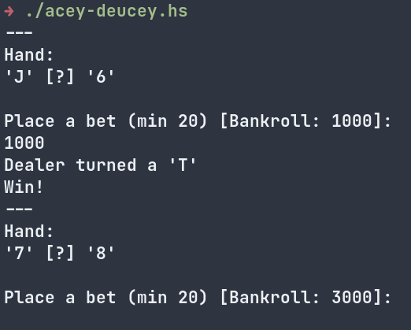

# Acey Deucey

This is a gambling game inspired by "acey deucey", also known as "Red Dog" or 
["yablon"](https://en.wikipedia.org/wiki/Yablon).

Run the game, look at the hand and enter a bet (minimum 20) based on whether the hidden
card will be between the two exposed cards.

When a good hand comes out (cards are far apart), take advantage of the odds and make a large bet.
When a bad hand comes out (cards are close together), make a small bet and move on.

Card ordering - `2 3 4 5 6 7 8 9 T J Q K A`

Good hand example (lots of cards in between):
```
  2 [?] K 
````
Bad hand example:
```
  2 [?] 4
```


