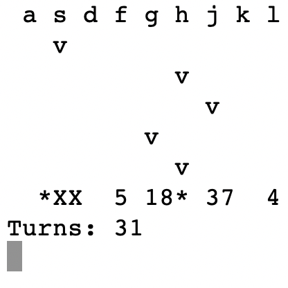

Shoot rockets using keys from the second row of a standard `en` keyboard. Move them left and right with arrow keys.

Tested with MacOS `Terminal.app`, should probably work with a bunch of other terminals.

