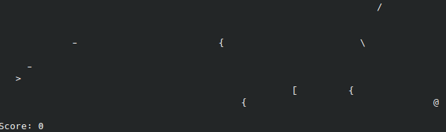

# Shmupemup

A terminal shmup game.

* Category: `default-10-80`
* Tested with: GHC 9.2.5
* Author: ElderEphemera (Josh Price)



Tap the WASD keys to move and Space to fire. Shoot down as many enemy space
ships as you can before one hits you!

## Running

On Linux and MacOS (untested, but it should work) you can run the game with
`runghc shmupemup.hs`.

On Windows, because of GHC issue #2189, the game must be compiled with the
native io manager which you can do with the command `ghc -with-rtsopts
--io-manager=native shmupemup.hs`. You will also have to enable VT100 support if
you don't want the screen to be repeated which you can do by running `reg add
HKCU\Console /v VirtualTerminalLevel /t REG_DWORD /d 1`.  There is also jitter
on Windows, Command Prompt seems to have less jitter than PowerShell or Windows
Terminal though.

## Implementation

The game state is just a list of lines (i.e. `[String]`) that is transformed
every frame by two Parsec parsers, one for horizontal interactions, and one for
vertical (handled by transposing the list, applying the parser, then transposing
back). The parsers look for specific patterns that get transformed according to
a set of rules. For example, the horizontal parser transforms `" @"` to `"@ "`,
causing that enemy to move forward and `"-@"` to `" X"` causing the enemy to be
hit by the shot. These parsers also depend on the user input, e.g. if "w" is
pressed then the vertical parser will include a rule transforming `" >"` to `">
"`, moving the player ship upwards.

Enemy spawning is handled by an non-rendered column of randomized characters on
the right of the screen. Whenever one of these characters happens to be one of
the characters that represent enemies, the interaction rules will move it to the
left so it is not deleted when the column is re-randomized. Scoring is handled
by simply counting the number of 'X's on the screen each frame and adding this
to the score.

## Unminified Code

```haskell
import Data.Char (chr)
import Data.Foldable (asum, fold)
import Data.Functor (($>))
import Data.List (transpose)
import GHC.Clock (getMonotonicTimeNSec)
import GHC.Conc (threadDelay)
import System.IO (hReady, hSetBuffering, hSetEcho, BufferMode(..), stdin)
import Text.Parsec ((<|>), anyChar, eof, many, oneOf, parse, string, try)

main = do
  hSetBuffering stdin NoBuffering
  hSetEcho stdin False
  loop 0 $ ('>' : replicate 79 ' ') : replicate 9 (replicate 80 ' ')

-- Renamed: !
loop n s=do
  putStr $ "\27[2J" ++ unlines (init <$> s) ++ "Score: "
  print n;
  time <- getMonotonicTimeNSec;
  threadDelay 50000;
  input <- getInput;
  loop
    (n + sum [ 1 | 'X' <- fold $ init <$> s ])
    (zipWith (\x-> (++[x]) . init . (applyParser $ horizontal input))
      (chr . (`mod` 150) . fromIntegral <$> iterate (0xe817fb2d*) time)
      (transpose . map (applyParser $ vertical input) $ transpose s))

-- Renamed: g
getInput = getInput' =<< hReady stdin;

-- Renamed: l
getInput' ready | ready = getChar <* getInput;
getInput' _ = pure '#';

-- Renamed: b
applyParser r = fold . fold . parse (many r) "";

-- Renamed: %
x --> y = string x $> y;

p # f = try p <|> f '#';

-- Renamed: f
enemy = oneOf "{[@\\/"

-- Renamed: h
horizontal 'a' = " >" --> "> " # horizontal
horizontal 'd' = "> " --> " >" # horizontal
horizontal ' ' = "> " --> ">-" # horizontal
horizontal _ = asum $ map try
  [ "- " --> " X " <* enemy
  , (:" ") <$> (string " " *> enemy)
  , "-" --> " X" <* enemy
  , ">" --> "X " <* enemy
  , enemy $> " "
  , string "-" *> anyChar $> " -"
  , (:[]) <$> anyChar
  ]

-- Renamed: v
vertical 's' = "> " --> " >" # vertical
vertical 'w' = " >" --> "> " # vertical
vertical _ = asum $ map try
  [ "X" --> " "
  , "/>" --> " X"
  , string "/" *> anyChar $> " /"
  , "/" --> "\\" <* eof
  , ">\\" --> "X "
  , anyChar *> "\\" --> "\\ "
  , "\\" --> "/"
  , (:[]) <$> anyChar
  ]
```
