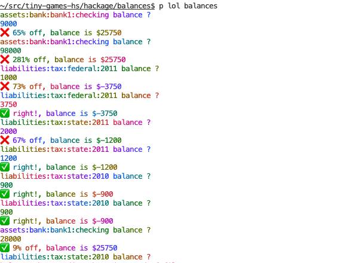
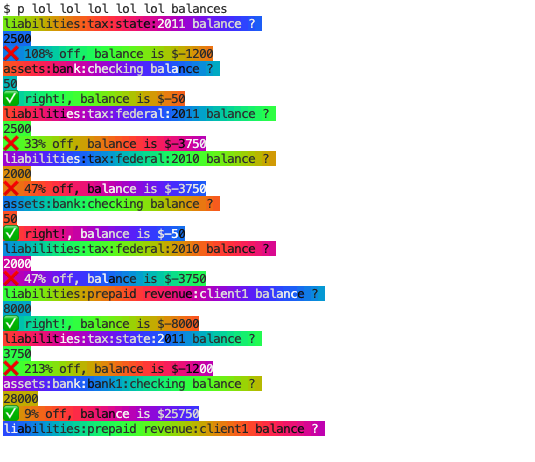

# balances


## Play

This "game" tests/drills your financial situational awareness, asking hledger
for the balance in random cash/liability accounts.
("Cash" accounts are liquid assets like your wallet or bank accounts but not investments.
Liabilities are debts.)

This is mainly for hledger users - not a super fun game but it could be a useful practice,
since it's easy to keep detailed records in hledger and yet still be unclear about current balances.

It uses your default hledger journal if you have one:
```
$ ./balances.hs
```

otherwise hledger-readable data obtained from elsewhere:
```
$ curl -O https://raw.githubusercontent.com/simonmichael/hledger/master/examples/templates.journal
$ export LEDGER_FILE=$PWD/templates.journal
```

For each requested account balance, guess a positive integer
(for multicurrency balances, just guess the most numerous currency).
Control-d to end. An example:

Optionally review balances first:
```
$ hledger bs type:CL
Balance Sheet 2013-01-31

                                           || 2013-01-31 
===========================================++============
 Assets                                    ||            
-------------------------------------------++------------
 assets:bank:bank1:checking                ||     $25750 
 assets:bank:bank1:prepaid revenue:client1 ||      $8000 
 assets:bank:checking                      ||       $-50 
-------------------------------------------++------------
                                           ||     $33700 
===========================================++============
 Liabilities                               ||            
-------------------------------------------++------------
 liabilities:prepaid revenue:client1       ||      $8000 
 liabilities:tax:federal:2010              ||      $3750 
 liabilities:tax:federal:2011              ||      $3750 
 liabilities:tax:state:2010                ||       $900 
 liabilities:tax:state:2011                ||      $1200 
-------------------------------------------++------------
                                           ||     $17600 
===========================================++============
 Net:                                      ||     $16100 
 ```
 
 Then test your recall:
 ```
$ clear
$ ./play balances.hs
assets:bank:checking balance ? 
8000
❌ 15900% off, balance is $-50
liabilities:tax:federal:2011 balance ? 
3000
❌ 20% off, balance is $-3750
liabilities:tax:state:2011 balance ? 
1000
❌ 17% off, balance is $-1200
liabilities:tax:federal:2010 balance ? 
4000
✅ 7% off, balance is $-3750
assets:bank:checking balance ? 
25000
❌ 49900% off, balance is $-50
liabilities:tax:state:2010 balance ? 
1200
❌ 33% off, balance is $-900
assets:bank:bank1:prepaid revenue:client1 balance ? 
8000
✅ right!, balance is $8000
assets:bank:checking balance ? 
balances.hs: <stdin>: hGetLine: end of file
```

Liven this up a bit with lols:






## About

balances.dev.hs is the readable/dev version, balances.hs the minified version.

This bridges two favourite hobbies, Plain Text Accounting and game development. 
It could perhaps become a more capable [hledger script](https://hledger.org/scripts.html)
with practical value.
