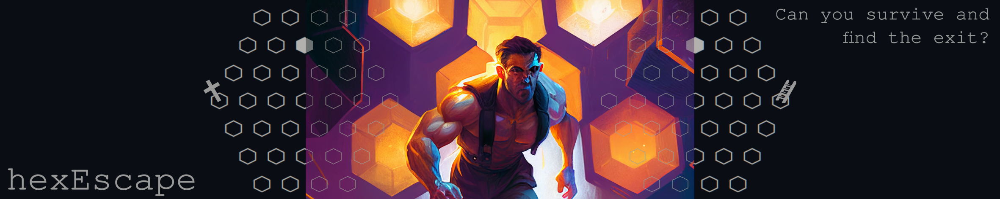

You wake up in an empty room with no memory. It's dark and wet and a staggering moldy stench fills the air. You groan and carefully turn your throbbing head, just to discover six doors, framed by noxious, orange light, leading to all directions. You hear rats crawling around you. Ugly, aggressive rats with voracious appetite. You have to get out of here!

## How to play

You are in room ⬢. Select the next, adjacent room ⬡ you want to explore with a number between 1 and 6 (+ Enter). Search for the exit 🪜, before you run out of health points (hp) and die ✝.

## Documentation

This is a minimal hex dungeon crawler game, implemented as a [stack script](https://docs.haskellstack.org/en/latest/scripts). It relies on the [grid](https://hackage.haskell.org/package/grid) library to model the dungeon. The code to draw the dungeon was copied from [this brilliant codegolf answer by Sacchan](https://codegolf.stackexchange.com/a/109828).

Here is a less minified version of the code:

```haskell
#!/usr/bin/env stack
-- stack script --resolver lts-20 --package grid,random

import Math.Geometry.Grid           (centre,directionTo,indices,neighbours,size)
import Math.Geometry.Grid.Hexagonal (hexHexGrid, HexHexGrid)
import System.Random                (randomRIO)
import Data.List                    ((\\))

type GridPosition = (
      Int -- coordinate 1
    , Int -- coordinate 2
    )
type World = (
      HexHexGrid   -- hexgrid
    , GridPosition -- position of the exit
    )
type Hero = (
      GridPosition -- current position in the grid
    , Bool         -- is the hero dead or has he escaped
    , Int          -- health points
    )

main :: IO ()
main = do
    -- make world and define exit position
    let gridHex = hexHexGrid 4
    let allCells = indices gridHex \\ [(0,0)]
    exit <- (allCells !!) <$> randomRIO (0, length allCells - 1)
    putStrLn $ "You wake up in the center. Where do you go?"
    -- run main game loop
    (_,_,hp) <- gameLoop (gridHex, exit) (head (centre gridHex), False, 100)
    -- resolve depending on the remaining healthpoints
    if hp <= 0 then putStrLn "✝ You die." else putStrLn $ "🪜 You found the exit!"

gameLoop :: World -> Hero -> IO Hero
gameLoop (w,t) (p,s,hp)
    -- hero found the exit
    | p == t = return (p, True, hp)
    -- hero is dead
    | hp <= 0 = return (p, True, hp)
    -- continue searching
    | otherwise = do
        -- draw world with the hero's position
        drawWorld (size w) p
        -- determine and print possible movement options
        let moveOptions = neighbours w p
        print $ zip [1..] (map (\x -> head $ directionTo w p x) $ moveOptions)
        -- get user input on movement direction
        input <- read <$> getLine
        -- determine and report random damage
        -- (done after the user input to prevent damage in the first room)
        damage <- randomRIO (0, 10)
        let newhp = hp - damage
        putStrLn $ "A rat bites you! You have: " ++ show newhp ++ "hp"
        -- call gameLoop again with new position and health points
        gameLoop (w,t) (moveOptions !! (input - 1), False, newhp)

-- copied from: https://codegolf.stackexchange.com/a/109828
drawWorld :: Int -> GridPosition -> IO ()
drawWorld n p = do
    mapM_
        (putStrLn . (\(k, r) -> ([k..n] >> " ") ++ (concatMap (drawCell n r p) [2..n+k])))
        (zip ([1..n-1] ++ [n, n-1..1]) [1..])

-- highlight cell if the hero is in it
drawCell :: Int -> Int -> GridPosition -> Int -> String
drawCell n row (a, b) col =
    if (n - row) == b && (if row <= n then (col - 1) - n else (col - 1) - n + (row - n)) == a
    then "⬢ "
    else "⬡ "
```

## Acknowledgements

The digital drawing in the banner was generated with an AI art service of the [midjourney](https://midjourney.com) lab.
