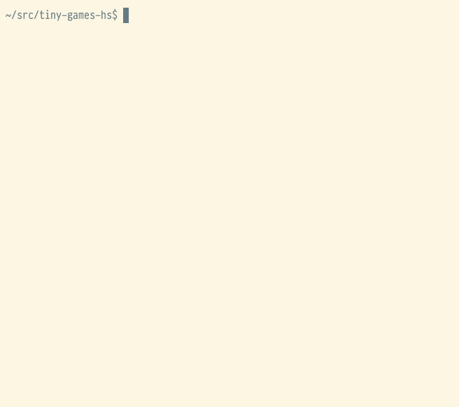

# ski

## Play

Get ready to ski! `,` and `.` move left and right.\
Avoid the 🌲 trees! 🌲 How long can you last ?

Best played in a white background terminal.

Uses emojis, may not look right or run well with all fonts/terminal apps.
Mac users: it is unplayably slow in Terminal or iTerm 3.4 -
use iTerm 3.5 beta or newer, or eg VS Code's terminal, instead.

## About

This is a classic - one of the simplest ways to build a fast action game
that could always be expected to run reasonably well,
since one thing every machine can do well is scroll text upwards...

Relying on print (putStrLn) means the player is always at the bottom of the
screen, with no forward visibility. But this could be quite realistic. :)

For a more elaborate version of this, with replayable levels, persistent high scores
and sound effects, try [caverunner](https://github.com/simonmichael/games/tree/main/caverunner).
