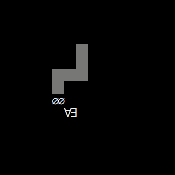

# Snake Lemma

Solve as much theorems as you can with the Snake Lemma! 

Change direction with `ijkl`.

Eat up the various theorems without becoming unsound via
self-reference (i.e. crossing the snake) or by going off-course
(i.e. crashing into the walls).

The rest is an exercise to the reader!

