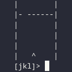

# pure-doors

An adventure game.



## Playing

The goal of pure-doors is to pass through doors by moving the player
left/forward/right with <kbd>j</kbd>/<kbd>k</kbd>/<kbd>l</kbd>. You
get one point per door.

Start by running [./pure-doors.hs](pure-doors.hs).

## Documentation

This game is powered by `interact :: (String -> String) -> IO ()`.
The trick is that the input/output are consumed/produced lazily.

For example:

```ShellSession
>>> interact (\input -> "World\n" <> "Prompt: " <> take 1 input <> "Done\n")
World
Prompt: <player input>
Done
```

As you can see, `interact` produces the output until the input is needed lazily.
Therefore, the whole game is a pure `String -> String` function, hence its name.

Here is the less-minified version with type annotations:

```haskell
#!/usr/bin/env runhaskell
-- | pure-doors expanded
-- Copyright 2023, Tristan de Cacqueray
-- SPDX-License-Identifier: CC-BY-4.0

-- | Door positions are generated using a 'zipWith' fib sequence.
type Position = Int

nums :: [Position]
nums = 1 : 2 : zipWith (+) nums (tail nums)

-- | Initialize the doors' distance.
type DoorDistance = Int
type Door = (DoorDistance, Position)
type World = [Door]

world :: World
world = map (\n -> (5, mod n 8)) nums

-- | Render a single line.
draw :: Char -> String -> Position -> String
draw sep mid pos = "|" <> replicate pos sep <> mid <> replicate (7 - pos) sep <> "|\n"

-- | An empty line.
emptyLine :: String
emptyLine = draw ' ' " " 7

-- | Draw the world and check for crash.
step :: Int -> Door -> Position -> World -> (World -> String) -> String
step 5 (0, door) pos world cont
    | -- last line contains a door, check the player position.
      door /= pos = "Crash!" <> cont []
    | -- the player passed a door, continue by adding the next door
      otherwise = step 5 (head world) pos (tail world) cont
step 5 (distance, door) pos world cont =
      -- draw the player and continue by reducing the current door distance
      draw ' ' "^" pos <> "[jkl]> " <> cont ((distance - 1, door) : world)
step n doorDistance@(distance, door) pos rest cont =
    (if (n == 5 - distance) then draw '-' " " door else emptyLine)
        <> step (n + 1) doorDistance pos rest cont

type Score = Int

-- | The main loop processing the user input.
go :: Score -> World -> Position -> String -> String
go score world pos input =
    "\ESCcpure-doors\n" <> step 0 (head world) pos (tail world) (\m -> case (m, input) of
    (_:_, c:'\n':xs) | c > 'h' && c < 'n' -> go (score + 1) m (pos + fromEnum c - 107) xs
    _ -> (if score > 5 then " GG, your score is: " <> show (div score 5) else "") <> "\n")

-- | Start the game.
main :: IO ()
main = interact (go (-1) world 3)
```

Note that the 9th door is impossible to pass, but there is a hidden trick:
use <kbd>i</kbd> and <kbd>m</kbd> to move the player by two :-)

Thanks for your time, have fun!
